## 1. 信息系统概论
card-last-score:: 1
card-repeats:: 1
card-next-schedule:: 2024-12-11T07:22:27.913Z
card-last-interval:: -1
id:: 6759313a-a42a-4cea-98a6-6c8bf5b80570
card-ease-factor:: 2.5
card-last-reviewed:: 2024-12-11T07:22:27.914Z
collapsed:: true
{{renderer :wordcount_6759313a-a42a-4cea-98a6-6c8bf5b80570}}
	- 什么是信息系统
	  logseq.order-list-type:: number
		- 什么是信息系统：
			- 用于**收集、存储和处理数据以及传递信息**、知识和数字产品的一组集成部件。商业公司或其他组织依靠信息系统来开展和管理他们的业务、与客户和供应商互动、并在市场上竞争。
		- 什么是信息系统：
			- ==信息系统是支持数据密集型应用的软硬件系统==。
	- 信息系统的架构
	  logseq.order-list-type:: number
		- 架构的定义
			- background-color:: red
			  
			  架构是针对某种特定目标系统的==普遍性问题==而提供的具有体系性质的、通用的解决方案，是对复杂系统的一种共性的体系抽象，目的是帮助人们能够正确 、合理地理解 、设计和最终构建复杂的系统 。
			- 系统的组成部分、它们相互之间的关系、对环境的关系和指导设计以及演进原则
			  logseq.order-list-type:: number
			- **针对特定系统的普遍性问题  成体系的通用解决方案  复杂系统的抽象体系表达** 目的是帮助人们正确的理解复杂的系统
		- 架构复杂度的定义
			- 动态复杂性：由于**不同节点之间相互关系的多样性和差异性以及动态运行**过程中的不确定性所带来的建设和维护的难度。
			  logseq.order-list-type:: number
			- 结构复杂性：系统中的层次结构给系统建设带来的难度。
			  logseq.order-list-type:: number
			- 动态复杂性：不同节点的动态关系
			- 结构复杂性：系统层次结构
		- ==信息系统复杂性问题是怎么产生的？评价信息系统复杂性的必要性？==
			- **体系结构是信息系统的基本结构**，它的复杂性直接影响着系统的复杂性。（会影响信息系统的安全性，尤其是可靠性）
			  logseq.order-list-type:: number
			- **在体系结构设计阶段有效控制复杂性，不仅可以减小系统实现的难度、降低成本，而且对提高系统可靠性等也有一定的帮助**。因此，对体系结构的复杂性进行度量和评价，对于系统的设计和决策非常重要。通过对体系结构复杂性的研究，对复杂性给出合适的定义和度量方法，就可以采取有效的措施来降低系统复杂性，减小复杂性所带来的不利影响。
			  logseq.order-list-type:: number
			- **等级层次结构是复杂性的主要根源之一**，复杂性与系统的等级层次结构有直接关系，层次越多，越容易产生复杂性。对于系统结构复杂性的度量就可以转换为对体系结构层次结构 复杂性的度量
			  logseq.order-list-type:: number
			- 体系结构是基本结构、体系结构是系统复杂性问题的主要根源之一、有效控制体系结构的复杂性可以很好的减少系统实现的难度降低成本等
	- ==复杂度度量方法==
	  logseq.order-list-type:: number
		- Halstead 复杂性度量
			- 设$n_1$表示程序中不同==运算符==的个数，$n_2$表示程序中**不同==操作数==的个数**，令H表示程序的预测长度
			  $$H=n_1log_2{n_1}+n_2log_2{n_2}$$
			  例子
			  使用五个变量（a、b、c、d和e）进行两两相加的操作。然后我们可以使用Halstead复杂度的概念来分析这段代码。
			  
			  ```java
			  public class Main {
			      public static void main(String[] args) {
			          int a = 1;
			          int b = 2;
			          int c = 3;
			          int d = 4;
			          int e = 5;
			  
			          int result1 = a + b;
			          int result2 = a + c;
			          int result3 = a + d;
			          int result4 = a + e;
			          int result5 = b + c;
			          int result6 = b + d;
			          int result7 = b + e;
			          int result8 = c + d;
			          int result9 = c + e;
			          int result10 = d + e;
			      }
			  }
			  ```
			  在这段代码中：
				- 不同的操作符  $n_1$: `int` `=`, `+` 和 `;`等，因此  $n_1$ = 11。
				  logseq.order-list-type:: number
				- logseq.order-list-type:: number
				  
				  计算Halstead复杂度的时候，我们通常只考虑实际的程序操作符（例如“+”，“=”）和关键字（例如“public”，“class”等）。
				- logseq.order-list-type:: number
				  
				  我们不会将括号、花括号和分号计入操作符，但它们是用来描述程序结构的。根据这样的规则，这里应该有11个不同的操作符。
				- 不同的操作数 n_2:  `a`, `b`, `c`, `d`, `e`, `result1`, `result2`, ..., `result10`, 因此 $n_2$ = 15 。
				  logseq.order-list-type:: number
				- 根据Halstead公式计算预测长度 ( H )：
				  logseq.order-list-type:: number
				  
				  $$
				  \begin{align}
				  H &= n_1 \log_2 n_1 + n_2 \log_2 n_2\\
				  &= 11 \log_2 11 + 15 \log_2 15\\
				  &\approx 97
				  \end{align}
				  $$ 
				  
				  by the way示例代码有64个字符
		- McCabe度量法
			- 算法1
			  
			  $$
			  V(G) = E - N + 2
			  $$
			  
			  其中：
				- V(G)  是循环复杂度
				- E 是控制流图中的**边的数量**
				- N  是控制流图中的**节点数量**
			- 算法2
			  更进一步通过计算程序中的决策点, **if/while/fo**r等循环判断条件语句, 来估算。
			  
			  $$
			  V(G) = P + 1
			  $$
			  
			  其中：
				- V(G) 是循环复杂度
				- P 是程序中的分支数（**if/while/for等循环判断条件语句的数量）
			- 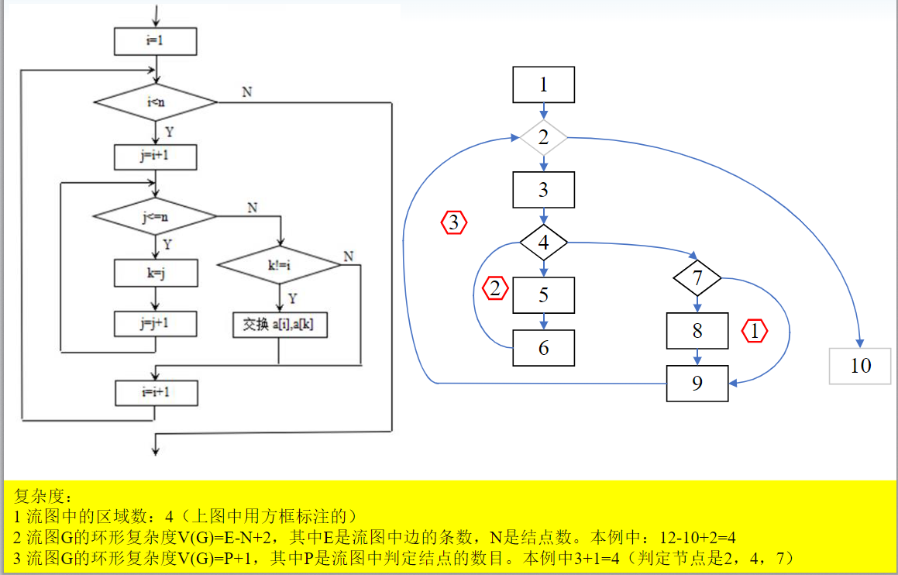{:height 448, :width 687}
			-
	- 能够进行简单的信息系统架构设计：淘宝
	  logseq.order-list-type:: number
	  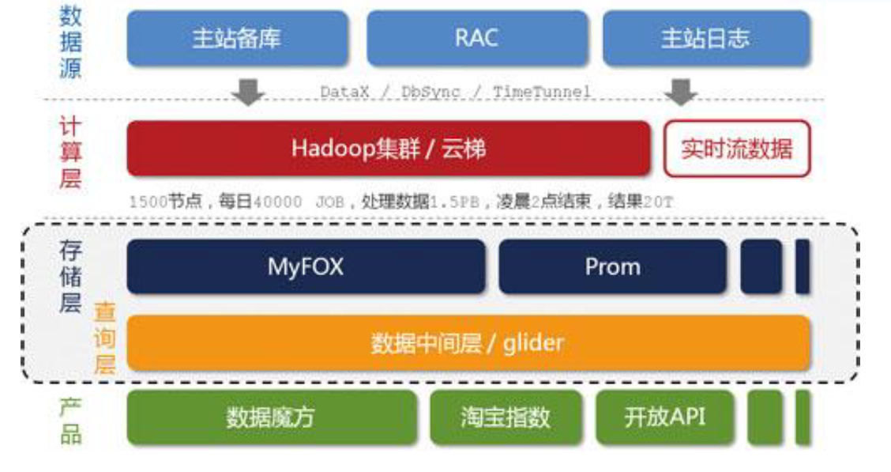
		- 数据源
			- 最上层是数据来源
			- RAC（Real Application Clusters）使用Oracle RAC解决方案高可用性数据库配置。
		- 数据传输工具
			- 表示为“传输层”的是负责将数据从数据源传输到Hadoop集群/云存储的工具。
			- 用于实现从源数据库到目标存储系统的数据迁移和同步
		- Hadoop集群/云梯：
			- 这一层显示的是数据存储和计算的主要环境。
		- 数据处理平台：
			- MyFOX和Prom用于数据处理和分析的定制工具或平台。
			- 用于数据清洗、转换和加载（ETL）任务。
		- **数据服务层**：
			- 表示为“数据中间层/glider”的可能是提供数据访问和服务化的中间件层。
			- 这一层处理数据的逻辑处理、服务封装和API暴露，使得上层应用能够访问和使用数据。
		- **上层应用**：
			- 最下方的绿色区域代表上层应用，包括数据可视化、业务逻辑处理和对外暴露的API。
			- 通过报表展示、数据分析或者通过API集成到其他应用。
	- ##  针对”秒杀“百万级并发架构设计，需要采用的关键技术（概率较大）
	  logseq.order-list-type:: number
		- （1）秒杀架构设计思路：
		  
		  ①将请求==拦截在系统上游==，降低下游压力：秒杀系统特点是并发量极大，但实际秒杀成功的请求数量却很少，所以如果不在前端拦截很可能造成数据库读写锁冲突，甚至导致死锁，最终请求超时。
		  ②充分==利用缓存==：利用缓存可极大提高系统读写速度。
		  ③==消息中间件：消息队列可以削峰，将拦截大量并发请求，这是一个异步处理过程==。后台业务根据自己的处理能力，从消息队列中主动地拉取请求消息进行业务处理。
		- （2）百万级并发相关技术：
		  
		  ①**==分布式==**：系统中多个模块在不同服务器上部署，即可成为分布式系统，如Tomcat和数据库分别部署在不同的服务器上。
		  ②**==高可用==**：系统中部分节点失效时，其他节点能够接替它继续提供服务。
		  ③**==集群==**：一个特定领域的软件部署在多台服务器上并作为一个整体提供一类服务，这个整体称为集群。
		  ④**==负载均衡==**：请求发送到系统时，通过某些方式把请求均匀分发到多个节点上。
		  ⑤**==正向代理和反向代理==**：正向代理是代理服务器代替系统内部来访问外部网络的过程，反向代理是外部请求访问系统时通过代理服务器转发到内部服务器的过程。
	-
	-
	-
	-
	-
	-
	-
	-
	-
	-
	-
	-
	-
	-
	-
	-
- ## 2. 信息系统安全概率
  id:: 67593f1a-5939-4102-bc23-11baf5a9e5d5
  collapsed:: true
  {{renderer :wordcount_67593f1a-5939-4102-bc23-11baf5a9e5d5}}
	- ### 1 信息系统常见的安全威胁
	  collapsed:: true
		- 信息系统安全威胁（threat）是指对于信息系统的组成要素及其功能造成某种损害的潜在可能。
		  collapsed:: true
			- 人为的威胁：
			  logseq.order-list-type:: number
				- 有意：窃听、信息修改、黑客、恶意代码、盗窃
				  logseq.order-list-type:: number
				- 意外：错误和遗漏、文件删除、路由错误、物理事故
				  logseq.order-list-type:: number
			- 自然的威胁：地震、闪电、洪水、火灾
			  logseq.order-list-type:: number
		- #### ==攻击致命度（AL  Attack lethality）==
		  collapsed:: true
			- 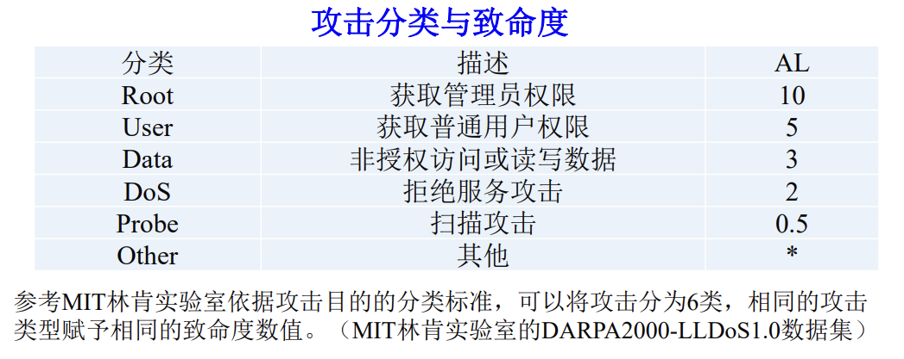
		- ==STIX==
		  collapsed:: true
			- 描述网络威胁信息的结构化语言
			- ==S==tructured ==T==hreat ==I==nformation e==X==pression **结构化威胁信息表达式**
			- 作为一种用于描述网络威胁信息的结构化语言，提供了基于标准 XML 语法描述威胁情报的细节和威胁内容的方法，也描述威胁情报中多方面的特征，包括威胁因素、威胁活动、安全事故等
			- ==五要素==：威胁指标 Indicator 、恶意软件 Malware 、工具 Tool 、 漏洞Vulnerability 、可观测数据 Observed Data 
			  
			  Indicator倾向于恶意行为痕迹
	- ### 2. 信息系统脆弱性
	  collapsed:: true
		- 信息系统的脆弱性：信息资产及其安全措施在安全方面的不足和弱点，脆弱性也常常被成为漏洞。
		- 硬件组件：信息系统硬件组件的安全隐患多来源于设计，主要表现为物理安全方面的问题。
		- 软件组件：软件组件的安全隐患来源于设计和软件工程中的问题。
			- 漏洞
			- 不必要的功能冗余引起安全脆弱性
			- 未按安全等级要求进行模块化设计，安全等级不能达到预期
		- 网络和通信协议：
			- TCP/IP协议族本身的缺陷
			- 基于TCP/IP协议Internet的安全隐患
				- 缺乏对用户身份的鉴别
				- 缺乏对路由协议的鉴别认证
				- CP/UDP的缺陷
	- ### ==3.  信息系统安全概念==
	  collapsed:: true
		- **基于信息保障的信息系统安全概念**如下
		  在信息系统的整个==生命周期==中，通过对信息系统的==风险分析==，制定并执行相应的安全保障策略，从==技术、管理、工程和人员==等方面提出安全保障要求，确保信息系统的==保密性、完整性和可用性== ，降低安全风险到可接受的程度，从而**保障系统实现组织机构的使命 。（目的）**
		  
		  KB：生命周期	风险分析	安全保障策略	人员技术工程管理	CIA
		- ==**信息系统安全保障的目的**==不仅是保护信息和资产的安全，更重要是
		  通过保障信息系统的安全来保障信息系统所支持的业务的安全，从
		  而达到实现企业使命的目的。
			- 进不来 拿不走 看不懂 改不了 跑不了
	- ### ==4. 攻防不对称性==
	  collapsed:: true
		- 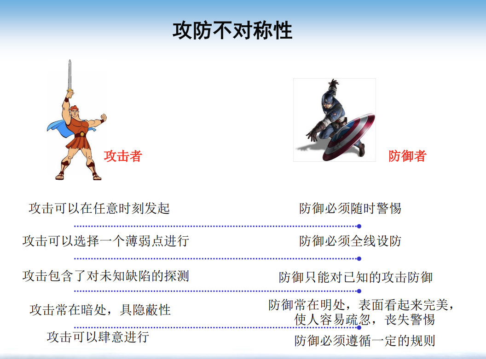
		- **拟态主动防御**:  利用不断变化的运行环境来增加攻击者的不确定性和攻击难度，从而提高系统的安全性。
		- #### 对攻防不对称性的其他解决思路
			- 加强威胁情报共享
			- 强化用户意识
			- 人工智能和机器学习
			- 零信任：企业基于持续验证、动态授权和全局防御三个核心原则构建自己的零信任网络。
			  
			  1） 持续验证，永不信任，构建身份安全基石
			  
			  2） 动态授权，精细访问控制，权限随需而动
			  
			  3） 全局防御，网安协同联动，威胁快速处置
			- SaaS化（软件即服务）、集约化：过去传统安全硬件面临突发威胁根本无法及时更新，但是SaaS化应对新威胁，几个小时之内就能将应对方案全面同步。SaaS化对安全厂商来说，可以更快速地迭代安全产品版本和能力，以应对快速变化的威胁，有效解决‘攻防不对等’的困境。
	- ### ==5. 信息系统安全保障模型CMM==
	  collapsed:: true
		- 框架和维度
		- CMM 框架全称是 "Cybersecurity Maturity Model Certification"（**网络安全成熟度模型认证**）。
		- 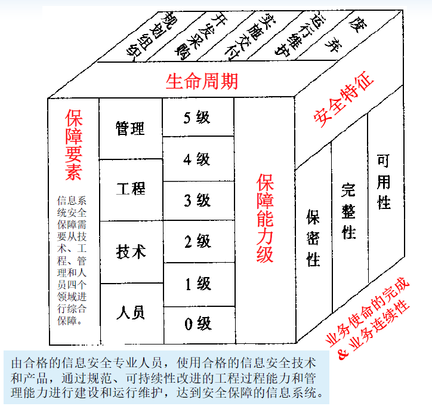
		- 信息系统安全保障体系的保障要素、保障能力级、安全特征、生命周期：
			- 保障要素：人员、技术、工程、管理
			  logseq.order-list-type:: number
			- 保障能力级：0级未实施、1级基本执行、2级计划跟踪、3级充分定义、4级量化控制、5级持续改进
			  logseq.order-list-type:: number
			- 生命周期：规划组织、开发采购、实施交付、运行维护、废弃
			  logseq.order-list-type:: number
			- 安全特征：保密性、完整性、可用性
			  logseq.order-list-type:: number
	- ### ==6. 怎样理解一个信息系统是安全的？== （重点）
	  collapsed:: true
		- （信息保障中，不是技术包揽天下）
		- ==信息网络的硬件、软件及其系统中的数据受到保护，不受偶然的或者恶意的原因而遭到破坏、更改、泄露，系统连续可靠正常地运行，信息服务不中断。==
		- 信息系统安全保障标准（大概率选择题）
			- 《==**GB/T 31495**==.1-2015 信息安全技术 ==信息安全保障指标体系及评价==
			  方法 第1部分：概念和模型》
			- 《GB/T 31495.2-2015 信息安全技术 信息安全保障指标体系及评价
			  方法 第2部分：指标体系》
			- 《GB/T 31495.3-2015 信息安全技术 信息安全保障指标体系及评价
			  方法 第3部分：实施指南》
		- **基于风险控制的理解**：
		  logseq.order-list-type:: number
			- 即把系统的风险控制到一个可以接受的范围之内。
		- **基于状态迁移的理解：**
		  logseq.order-list-type:: number
			- 即系统的状态无论怎么迁移，也不可能进入对应不安全状态的空间。
		- **基于时间的理解：**（24年ppt里只有这个）
		  logseq.order-list-type:: number
		  background-color:: red
			- 信息系统安全是个时间的概念：若发现攻击的时间＋做出响应的时间＜黑客实现攻击的时间，则认为这个信息系统是安全的。
			  background-color:: red
			- 新的安全定义
			  background-color:: red
				- 及时的检测就是安全
				  background-color:: yellow
				- 及时的响应就是安全
				  background-color:: yellow
		- **基于安全体系架构的理解：**
		  logseq.order-list-type:: number
			- 不仅要重视功能上的体系架构，还要重视安全体系架构。以云计算为例，讲稿提供了多种典型安全架构，它们要么提供很好的隔离性，要么以可信、可控的方式，可以保证信息系统的业务连续性。
		- **基于安全策略的理解：**
		  logseq.order-list-type:: number
			- 一个系统是“安全系统”，指的是该系统达到了当初设计时所制定的安全策略的要求。
			- **安全策略**： 针对面临的威胁决定采用何种对策的方法
			  **安全策略意义上的信息系统安全**： 该系统达到了当初设计时所制定的安全策略的要求。
	- ==云计算安全架构的最新发展：了解==
	  collapsed:: true
		- （1） 基于可信根的安全架构
		- （2） 基于隔离的安全架构
		- （3） 安全即服务的安全架构
		- （4） 可管、可控、可度量的云计算安全架构：
	-
	-
- ## 3. 安全需求以及安全策略
  id:: 67594ae6-58ab-439f-9ad3-41132937d1ac
  collapsed:: true
  {{renderer :wordcount_67594ae6-58ab-439f-9ad3-41132937d1ac}}
	- ### 1. 安全需求
	  collapsed:: true
		- 就是在设计一个安全系统时==期望得到的安全保障==
		- 启动阶段的目标
			- 根据业务流程、系统功能、目标用户、工作环境等，定义系统的需求
			  logseq.order-list-type:: number
			- 明确约束条件，包括场地、设备、经费、人员等
			  logseq.order-list-type:: number
			- **==起草一份针对系统的安全策略==**
			  logseq.order-list-type:: number
				- 这是这一阶段必不可少的部分，是构建一个可信系统的**基础**
			- 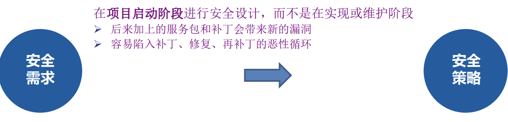
		- 一般性需求
			- **机密性需求** ，防止信息被泄漏给未授权的用户
			- **完整性需求**， 防止未授权用户对信息的==修改==
			- **可用性需求**， 保证授权用户对系统信息的==可访问性==
			- **可记账性需求**， 防止用户对访问过某信息或执行过某一操作以否认，可对发生的事件、操作等进行回溯
			- 举例
			  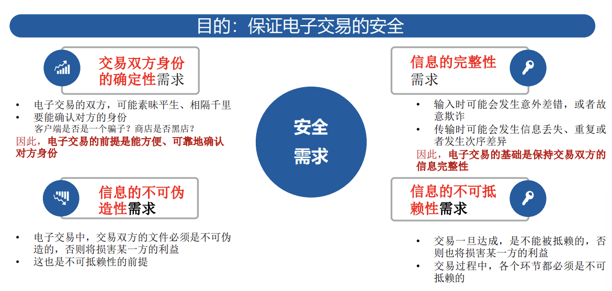
	- ### 2.  安全策略
	  collapsed:: true
		- ==针对面临的威胁决定采用何种对策的方法==
		  信息系统安全策略提供：信息系统保护的内容和目标，信息保护的职责落实，实施信息保护的方法，事故的处理等。
		  （要保护什么 ，谁来负责、怎么做、出事了怎么办）
		- 一个信息系统是“安全系统”，指的是该系统达到当初设计时所制定的安全策略的要求
		- 实例：secpol.msc、windows 2008 server r2
		- 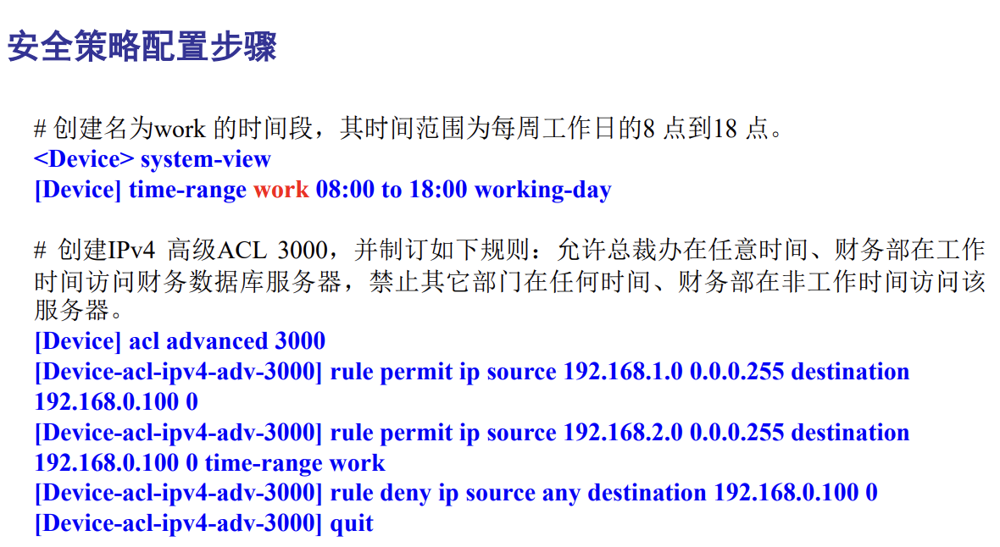
	- ### 3. 最常用的安全策略
	  collapsed:: true
		- 
	- ### ==4. 自主访问控制策略（DAC）ACL必考==
	  collapsed:: true
		- #### DAC相关信息
			- 主要就在==**自主**==两个字上
			- DAC概念：允许系统中信息的拥有者按照自己的意愿去指定对象以何种访问模式去访问该客体。
			- **Windows中的访问控制模型是Windows安全性的基础构件**
				- 访问控制模型有两个主要的组成部分：访问令牌（Access Token）和安全描述符（Security Descriptor）。它们分别是访问者和被访问者拥有的东西。
				- 通过访问令牌和安全描述符的内容，Windows可以确定持有令牌的访问者能否访问持有安全描述符的对象。
				- 有令牌且符合安全描述符要求的windows才会放行
			- 自主访问控制的优点：
			  background-color:: red
				- 访问模式设定灵活。
				  background-color:: red
				- 具有较好的适应性，常用于商用OS和应用中。
				  background-color:: red
			- 自主访问控制的缺点
			  background-color:: green
				- 不能防范木马和某些形式的恶意代码
				  background-color:: green
		- ####  访问控制列表（ACL）
			- background-color:: yellow
			  
			  定义：访问控制列表是一系列允许或拒绝数据的指令的集合。具有灵活的数据过滤盒控制能力。
			- 原则：最小特权原则、最靠近受控对象原则、默认丢弃原则
				- 编号：1） 1-99或1300-1999是标准ACL使用的，100-199或2000-2699是拓展ACL使用的。
		- #### 标准ACL
			- 源ip过滤，设置在目的路由器
			- 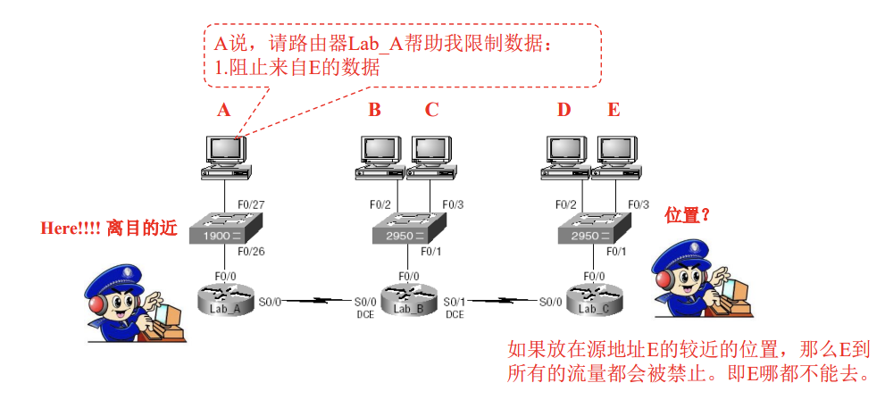
			- 访问列表号==1～99==
				- 传统范围：1-99和1300-1999
		- #### 扩展ACL
			- **源IP地址、目的IP地址、协议字段（如，TCP、UDP、ICMP等）以及端口号**。
			- 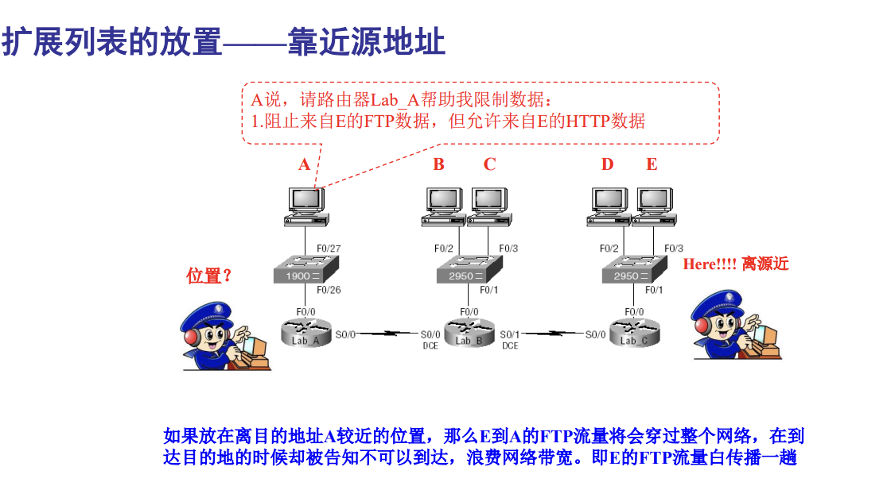
			- **靠近源地址路由器**
				- 使用访问列表号**100～199**创建扩展的访问列表
					- 传统范围：100-199和2000-2699
		- #### 命名ACL
			- 命名ACL以列表名代替列表编号来定义IP访问控制列表，同样包括标准和扩展两种列表，定义过滤的语句与编号方式中相似。
	- ### ==5. 语法 （必考，而且要会写）==
	  collapsed:: true
		- #### 创建标准ACL
			- ```apl
			  Router(config)# access-list access-list-number { permit | deny } source [source-wildcard]
			  //例子
			  //这条命令将允许源地址为192.168.1.0到192.168.1.255的所有数据包通过。
			  Router(config)# access-list 10 permit 192.168.1.0 0.0.0.255
			  //注意取掩码的反码
			  ```
			- #### 字段解释
				- `Router(config)#`：这是Cisco IOS的命令提示符，表示您目前处于全局配置模式。
				- **`access-list`**: 命令关键字，用于定义访问控制列表。
				- **`access-list-number`**: 指定访问列表的编号。对于标准ACL，通常是1-99的范围。
				- **`{ permit | deny }`**: 指定动作，可以是以下两种：
					- **`permit`**: 允许数据包通过。
					- **`deny`**: 拒绝数据包通过。
				- **`source`**: 指定源IP地址。
				- **`[source-wildcard]`**: 可选的通配符掩码，用于指定源IP地址的范围。
				  注意取掩码的反码
		- #### 删除标准ACL
			- #### 命令格式
			  
			  ```apl
			  Router(config)# no access-list access-list-number
			  //例子
			  //这条命令将删除编号为10的访问控制列表。
			  Router(config)# no access-list 10
			  ```
			- #### 字段解释
				- **`Router(config)#`**: 这是Cisco IOS的命令提示符，表示您目前处于全局配置模式。
				- **`no`**: 命令前缀，用于撤消先前的命令或设置。
				- **`access-list`**: 命令关键字，用于定义访问控制列表。
				- **`access-list-number`**: 指定要删除的访问列表的编号。
		- #### 扩展ALC创建指令
			- 创建扩展访问控制列表（ACL）通常涉及到在网络设备（如路由器或交换机）上执行特定的命令。扩展ACL比标准ACL提供更详细的控制，允许基于源地址、目的地址、协议类型、端口号等过滤流量。以下是一个通用的命令格式用于创建和配置扩展ACL，以及各参数的含义：
			- ##### 基本命令格式
			  
			  ```apl
			  access-list [ID] [permint/deny] [协议] [源IP地] [源通配符掩码] [目的IP] [目的通配符掩码] [操作符] [端口/服务类型]
			  ```
			- **操作符**：通常用于定义端口号。常见的操作符包括：
				- ==eq（等于）：指定目标端口必须等于某个特定值==
				- `gt`（大于）：指定目标端口必须大于某个特定值。
				- `lt`（小于）：指定目标端口必须小于某个特定值。
			- **端口**：端口号是用来标识主机上的特定网络服务。在ACL中，端口号用来定义特定类型的网络流量，如HTTP流量通常使用端口80。
			- **服务类型**：这是指网络上的特定服务或协议。例如，HTTP、FTP、SSH等都是不同的服务类型，它们分别在网络层使用特定的协议和端口号。在ACL中，可以指定这些服务类型来控制特定协议的流量。
		- #### 通配符
			- ==host==
				- host关键字用于指明这条规则仅适用于这一个特定的IP地址，而非一个地址范围。
				- 如果没有使用`host`关键字，需要提供一个IP地址和一个通配符掩码来定义一个IP地址范围。
				- ```apl
				  Lab_A(config)#access list 110 deny tcp any **host 172.16.30.2** eq www
				  ```
				  含义：拒绝任何IP 地址通过 TCP 协议访问主机172.16.30.2的www服务。
			- ==any==
				- 如果 `any` 用在规则中指定源IP地址或目的IP地址，它意味着规则适用于所有可能的IP地址。例如，如果在源地址位置使用 `any`，则该规则适用于来自任何IP地址的流量。
		- #### 题目：
			- ```apl
			  要禁止内网中 IP 地址为 192.168.46.8 的 PC 机访问外网, 正确的 ACL 规则是
			  A. access-list 1 permit ip 192.168.46.0 0.0.0.255 any
			  access-list 1 deny ip host 192.168.46.8 any
			  B. access-list I permit ip host 192.168.46.0 0.0.0.255 any 
			  access-list 1 deny ip 192.168 .46 .0 0.0.0.255 any
			  C. access-list 1 deny ip 192.168.46.0 0.0.0.255 any 
			  access-list 1 permit ip host 192.168.46.8 any
			  D. access-list 1 deny ip host 192.168.46.8 any 
			  access-list 1 permit ip 192.168 .46 .0 0.0.0.255 any
			  ```
			  
			  这题选D，先定义的先执行，因此要先ban掉，再允许这个网段的其他ip访问。
	- ###  通配编码
	  collapsed:: true
		- 路由器使用IP地址和通配掩码（wildcard-mask）一起来分辨匹配的地址范围，它跟子网掩码刚好相反。
		  
		  它不像子网掩码告诉路由器IP地址的哪一位属于网络号一样，通配符掩码告诉路由器为了判断出匹配，它需要检查IP地址中的多少位。
		  有了通配掩码，可以只使用两个32位的号码来确定IP地址的范围，这是十分方便的！
		  
		  如果没有掩码的话，不得不对每个匹配的IP地址加入一个单独的ACL语句。这将造成很多额外的输入和路由器大量额外的处理过程。所以地址掩码相当有用。
		- 通配掩码原理是分成4字节的32bit数
		  logseq.order-list-type:: number
		- 通配掩码与IP地址位位配对，相应位为0/1，用于表示如何对待IP地址中的相应位。
		  logseq.order-list-type:: number
		  
		  ①通配掩码某位是0表示检查相应bit位的值
		  
		  ②通配掩码某位是1表示不检查（忽略）相应位的值
		- 通配源码举例：
		  logseq.order-list-type:: number
		  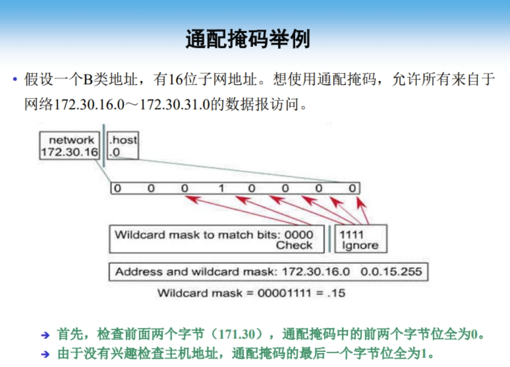 
		  因此本例中通配掩码为0.0.15.1
		- any——通配符特殊应用：
		  logseq.order-list-type:: number
			- 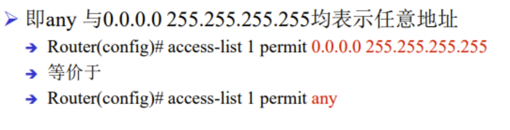
		- host——通配符特殊应用：
		  logseq.order-list-type:: number
			- 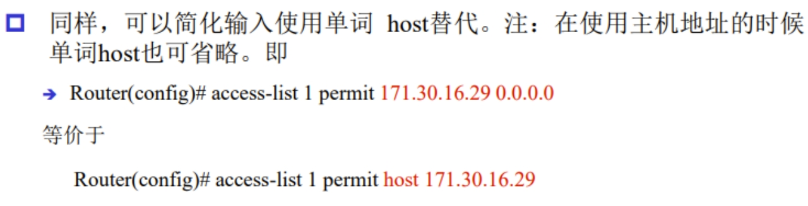
	- ###  ==强制访问控制策略（MAC）==
		- ####  定义
			- 在强制访问控制系统中，所有主体（用户，进程）和客体（文件，数据）都被分配了安全标签，安全标签标识一个安全等级。
			- 主体（用户，进程）被分配一个安全等级
			- 客体（文件，数据）也被分配一个安全等级
			- 访问控制执行时对主体和客体的安全级别进行比较
		- 经典场景：军事机密及其管理
		- ➢ 无密级；保密；机密；绝密。
		  ❖ 强制访问控制，基于上述原型而来
		  ➢ 主体/客体：贴上标签
		  ➢ 引用监视器：比较标签，决定是否许可
		  ❖ 效果：保证完整性或机密性
		- 最显著的特征：全局性和永久性
		  background-color:: red
			- 无论何时何地，主体和客体的标签是不会改变的。
			- ==全局性==：对特定的信息，从任何地方访问，它的敏感级别相同
			- ==永久性==：对特定的信息，在任何时间访问，它的敏感级别相同
			- 上述特征在多级安全体系中称为“==宁静性原则==”（tranquility）
		- 一旦不满足该原则，无法从根本上防备木马和恶意代码
		- #### 附加：
			- MAC存在的问题：
				- 隐通道问题：仍然无法检测到高安全级主体和低安全级客体在不违反安全策略的情况下通过合谋传输秘密信息。
		- #### BLP保密模型
			- 概念：
				- Bell-LaPadula保密性模型是第一个能够提供分级别数据==机密性==保障的安全策略模型（多级安全）。
			- BLP模型允许用户读取安全级别比他低的资源；相反地，写入对象的安全级别只能高于用户级别。
			- BLP 保密模型基于两种规则来保障数据的机密度与敏感度：
				- 不上读（NRU）⎯⎯主体不可读安全级别高于它的数据
				  background-color:: red
				- 不下写（NWD）⎯⎯主体不可写安全级别低于它的数据
				  background-color:: red
			- BLP模型的应用——防火墙所实现的单向访问机制：
				- 防火墙所实现的单向访问机制不允许敏感数据从内部网络（所有内部数据被标志为“机密”或“高密”）流向Internet（安全级别为“公开”）。
				- 防火墙提供“不上读”功能来阻止Internet对内部网络的访问；
				- 提供“不下写”功能来限制进入内部的数据流只能经由由内向外发起的连接流入。（例如，允许HTTP的“GET”操作而拒绝“POST”操作，或阻止任何外发的邮件）。
			- 不上读和不下写
				- 不上读 NRU（No Read Up）：主体不可读安全级别高于它的数据
				- 不下写 NWD（No Write Down）：主体不可写安全级别低于它的数据
			- **优点**：
				- **适用性广**：由于其简单的原则，BLP模型适用于需要严格保密性的环境.
				  **缺点**：
				- **不考虑数据完整性**：BLP模型专注于保密性而不是数据完整性，因此不能防止数据被授权用户篡改。
				- **动态性不足**：在需要频繁数据交换的环境中，BLP模型的固定规则可能会阻碍数据共享和协作。
					- BLP模型允许用户读取安全级别比他低的资源；相反地，写入对象的安全级别只能高于用户级别。
		- ####  BIBA完整性模型
			- 强调==完整性==
				- 不下读（ NRU ）属性主体不能读取安全级别低于它的数据
				  不上写（ NWD ）属性主体不能写入安全级别高于它的数据
			- **优点**：
				- **避免数据污染**：通过限制低完整性级别的用户访问更高完整性级别的数据，防止了数据被污染。
			- **缺点**：
				- **灵活性有限**：BIBA模型较为严格，可能会限制某些合法的数据访问和操作，影响业务流程的灵活性。
				- **复杂的实施**：在实际环境中实施BIBA模型可能会相对复杂，需要精确地定义完整性级别和相应的控制策略。
			- ##### 防火墙
				- Internet上用户的安全级别为“公开”，依照 BIBA 模型， Web 服务器上数据的完整性将得到保障.
				- Internet 上的用户只能读取服务器上的数据而不能更改它。因此，任何 POST 操作将被拒绝。
		- #### Chinese Wall模型
			- Chinese Wall模型应用在多边安全系统中（也就是多个组织间的访问控制系统），
			  目标主要就是==防止利益冲突的发生==
				- Chinese Wall模型最初是为投资银行设计的，主要关注商业利益问题，使用范围有限，但也可应用在其它相似的场合。在投资银行中，一个银行会同时拥有多个互为竞争者的客户，一个银行家可能为一个客户工作，但他可以访问所有客户的信息。因此，应当制止该银行家访问其它客户的数据
			- Chinese Wall模型的主要功能是==防止用户访问被认为是存在利益冲突的数据。==、
			- 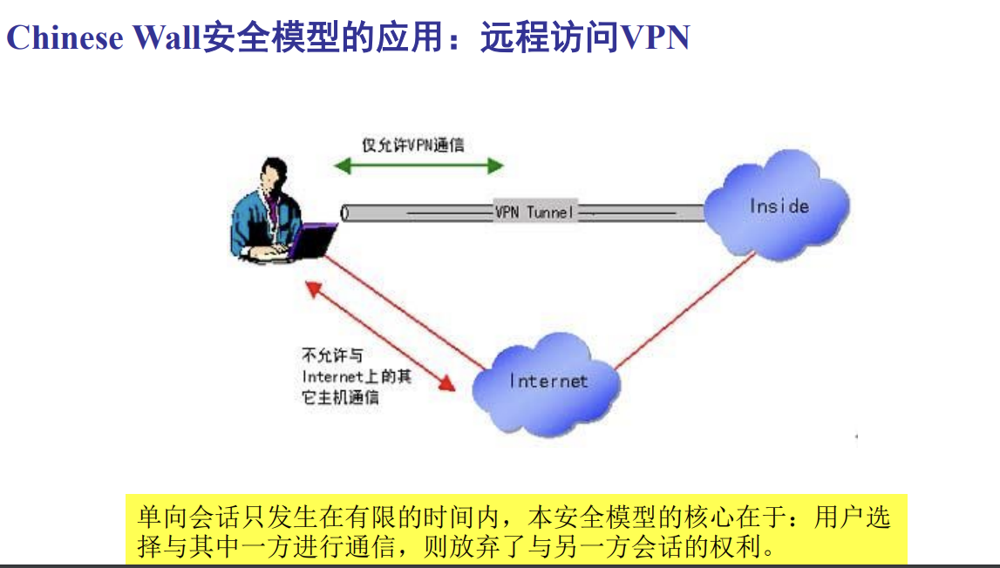
		- ####  SSR
			- （是否可以设计一种基于BLP模型和BIBA模型的混合模型，从而技能保护数据的==机密性==，又能保证其==完整性==）
			- SSR的访问控制为
				- 允许同级别的主体对客体享有所有权限；
				- 高级别主体对低级别客体享有只读权限；
				- 低级别主体对高于自己级别的客体没有任何权限
			- SSR的主要特点
				- 信息流只能从低级别流向高级，确保信息的保密性
				- 高级别主题队低级别客体的访问只能进行读取，确保了低级别资源的完整性
		- ###  安全策略如何应用到防火墙等安全设备中？
			- BLP模型的应用——防火墙所实现的单向访问机制：防火墙所实现的单向访问机制不允许敏感数据从内部网络（所有内部数据被标志为“机密”或“高密”）流向Internet（安全级别为“公开”）。
			- 防火墙提供“不上读”功能来阻止Internet对内部网络的访问；
			- 提供“不下写”功能来限制进入内部的数据流只能经由由内向外发起的连接流入。（例如，允许HTTP的“GET”操作而拒绝“POST”操作，或阻止任何外发的邮件）。
		-
- ## 4.安全风险评估
  collapsed:: true
  {{renderer :wordcount_675984bc-6691-4de9-b655-e5bb9dfc8577}}
	- ### 4.1 风险的概念
		- 风险： 风险指在某一特定环境下，在某一特定时间段内，特定的威胁利用资产的一种或一组薄弱点，导致资产的丢失或损害的潜在可能性，==即特定威胁事件发生的可能性与后果的结合。==
			- 风险越大则安全性越低，反之风险越小则安全性越高。
		- 残余风险：采取了一系列安全措施后，仍然存在的风险
	- ### 4.3 安全风险度量/评估
		- 安全风险概念模型
			- 安全风险四要素：==信息系统资产（Asset）==、==信息系统脆弱性（Vulnerability）==、==信息安全威胁（Threat）==、==信息系统安全保护措施（Safeguard）==。、
			- 跟上面的四个是对应的
		- 概念定义
			- 对信息系统整体安全态势的感知和对重大安全事件的预警，实现“==事前能预防，事中能控制，事后能处理”==。
			- 风险评估是参照国家有关标准对信息系统及由其处理、传输和存储信息的保密性、完整性和可用性等安全属性进行分析和评价的过程。它要分析：
			  collapsed:: true
				- 资产面临的威胁及威胁利用脆弱性导致安全事件的**可能性**；
				- 根据资产价值来判断安全事件一旦发生对组织**造成的影响**。
		- **风险评估围绕着==资产、威胁 、脆弱性和安全措施==这些基本要素展开 。**
		- 风险评估实质上就是要度量风险各要素之间的**相互作用关系**
		- 脆弱性越多，”威胁“（实际上就是黑客）利用脆弱性导致安全事件的可能性就越大
		- **残余风险应受到密切监视，它可能会在将来诱发新的安全事件**
	- ### 4.4 信息系统安全风险计算模型（基本原理） #card
	  card-last-interval:: 4
	  card-repeats:: 1
	  card-ease-factor:: 2.36
	  card-next-schedule:: 2024-12-15T12:55:20.531Z
	  card-last-reviewed:: 2024-12-11T12:55:20.532Z
	  card-last-score:: 3
	  collapsed:: true
		- 法律：==**GB/T20984-2007**==
		- 风险计算模型是对通过风险分析计算风险值过程的抽象，它主要包括**资产评估、威胁评估、脆弱性评估**。
		  collapsed:: true
			- 
			- 风险分析涉及资产、威胁、脆弱性等基本要素，每个要素有各自的属性：
			  （1） 资产的属性是资产价值，
			  （2） 威胁的属性是威胁出现的频率，
			  （3） 脆弱性的属性是资产弱点的严重程度。
	- ### 4.5 风险处置策略（基本原理）
		- **降低风险（Reduce Risk）**
			- 采取适当的控制措施来降低风险，包括技术手段和管理手段，如安装防火墙，杀毒软件，或是改善不规范的工作流程、制定业务连续性计划，等等。
		- **避免风险（Avoid Risk)**
			- 通过消除可能导致风险发生的条件来避免风险的发生，如将公司内外网隔离以避免来自互联网的攻击，或是将机房安置在不可能造成水患的位置等等。
		- **转移风险（Transfer Risk)**
			- 将风险全部或者部分地转移到其他责任方，例如购买商业保险。
		- **接受风险（Accept Risk)**
			- 在实施了其他风险应对措施之后，对于残留的风险，可以有意识地选择接受。
	- ### 4.6基本操作.
		- **1 风险评估（这一套必须掌握！）**
			- 必须把这一套流程都掌握下来，对攻击性，对资产进行评分…不会纠结为什么那么评分，而是一套流程对不对。评分，设计公式计算出一个值，最后得出一个归一化的风险值是0-5。
		- #### 4.3.1 AV资产评估
			- 针对==**资产保密性、完整性、可用性**==1~5分重要性赋值
			- 然后计算资产登记，也是赋值1~5，
			- AV=F(AC, AI, AA)
			  Asset Value 资产价值
			  Asset Confidentiality 资产保密性赋值
			  Asset Integrity 资产完整性赋值
			  Asset Availability 资产可用性赋值
			- 注意如果采用
			  AV=AC+AI+AA
			  AV=AC × AI × AA
			  那么最后也是根据比例进行赋值1~5
		- #### 4.3.2 T威胁评估
		  针对威胁出现频率进行1~5分赋值
		- #### 4.3.3 V脆弱性评估
		  针对系统脆弱性进行1~5分赋值
		- #### 4.3.4 风险计算 矩阵法
			- 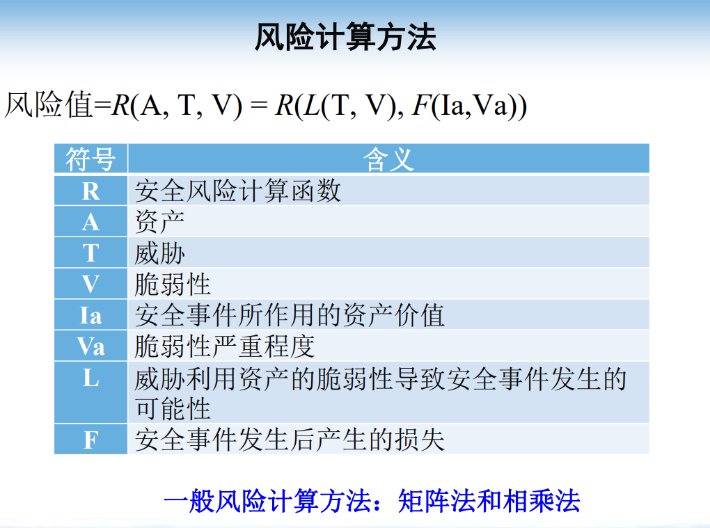
			- 风险=资产价值×威胁评估×脆弱性评估
			  总分125，也是1~5风险大小赋分
			- 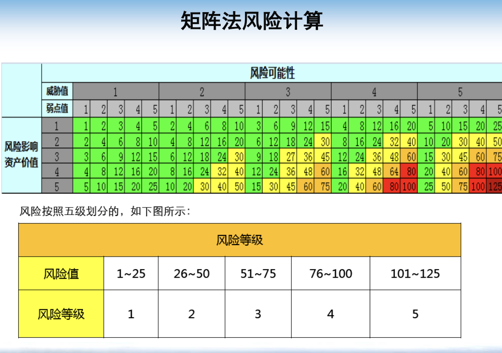
		- #### 5. 残余风险评价
			- 绝对安全（即零风险）是不可能的。
			- 实施安全控制后会有残留风险或残存风险。
			- 为确保信息安全，应该确保残留风险在可接受的范围内：
			  1） 残留风险Rr＝原有风险R0-控制ΔR
			  2） 残留风险Rr≤可接受的风险Rt
			  3） 对残留风险进行确认和评价的过程其实就是风险接受的过程。决策者可以根据风险评估的结果来确定一个阈值，以该阈值作为是否接受残留风险的标准。
	-
	-
- ## 5.信息系统等级保护
  collapsed:: true
  {{renderer :wordcount_675a5dfa-84b4-4643-a76d-80815e0a1c9c}}
	- ### 概念（重点）
		- 什么是等级保护？
			- 等级保护是**《网络安全法》**规定的一项基本制度。
				- **《网络安全法》**是网络安全领域的基本法，国家等级保护制度进入2.0 时代
				- 网络安全等级保护制度是==**关键信息基础设施保护**==的基础，关键信息基础设施是等
				  级保护制度的保护重点
					- （知道怎么解释关键信息基础设施） 第二条 本条例所称关键信息基础设施，是指公共通信和信息服务、能源、交通、水利、金融、公共服务、电子政务、国防科技工业等重要行业和领域的，以及其他一旦遭到破坏、丧失功能或者数据泄露，可能严重危害国家安全、国计民生、公共利益的重要网络设施、信息系统等。
				- （法律编号要知道）
				  《信息安全技术网络安全等级保护基本要求》**GB/T 22239**-2019
				  《信息安全技术网络安全等级保护定级指南》**GB/T 22240** 2020（2020年11月1日实施）《信息安全技术网络安全等级保护安全设计要求》**GB/T 25070**-2019
				  《信息安全技术网络安全等级保护测评要求》**GB/T 28448**-2019
				  《信息安全技术网络安全等级保护测评过程指南》**GB/T28449**-2018 
			- 对国家重要信息、法人和其他组织及公民的专有信息以及公开信息和存储、传输、处理这些信息的==信息系统分等级==实行安全保护，对信息系统中使用的==信息安全产品实行==按等级管理，对信息系统中发生的==信息安全事件分等级响应、处置==。
		- 等级保护vs分级保护：
			- 分级保护：信息的重要程度决定级别，分为三个级别。由国家保密局负责。
			- 等级保护：由业务系统的重要程度及遭到破坏后的危害程度决定级别，分为五个级别。由公安部负责。
		- 国家信息安全等级保护**==坚持自主定级、自主保护==**的原则。
		- ==定级对象：==也称等级保护对象、网络安全等级保护工作的作用对象。
			- 包括网络基础设施（广电网、电信网、专用通信网络等）、云计算平台系统、大数据平台系统、物联网、工业控制系统、采用移动互联技术的系统等
	- ### 总结
		- ###  等级保护主要工作：
		  网络安全等级保护工作包括定级备案、建设整改、等级测评、监督检查4个阶段。
		- **（1、2）定级备案：**
		- **（3）建设整改：**使确定了等级的信息系统能够达到相应等级的基本的保护水平和满足自身需求的安全保护能力。
			- ①建设：运营使用单位按照管理规范和技术标准，选择管理办法要求的信息安全产品， 建设符合等级要求的信息安全设施，建立安全组织，制定并落实安全管理制度。
			- ②整改：对于未达到安全等级保护要求的，运营、使用单位应当进行整改。整改完成应当将整改报告报公安机关备案。
		- **（4）等级测评：**
			- 运营、使用单位或者主管部门应当选择合规测评机构，定期对信息系统安全等级状况开展等级测评。三级及以上信息系统至少每年进行一次等级测评，四级及以上信息系统至少每半年进行一次等级测评，五级应当依据特殊安全需求进行等级测评。测评机构应当出具测评报告，并出具测评结果通知书，明示信息系统安全等级及测评结果。
		- **（5）监督检查**
	- ### 工作流程(五个规定动作 原理)
		- 网络安全等级保护工作包括定级 、 备案 、 建设整改 、 等级测评 、 监督检查五个阶段 。
			- 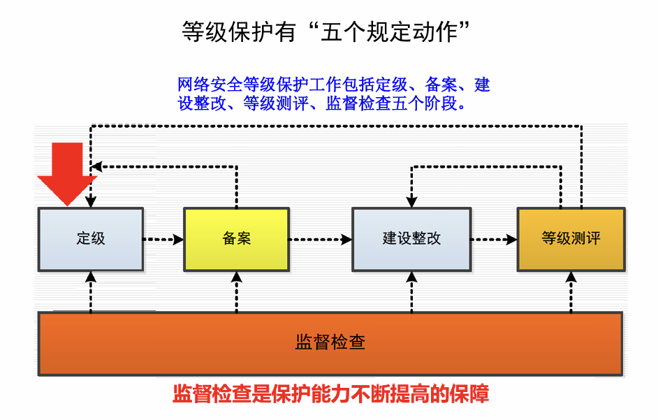{:height 441, :width 679}
	- ### 定级备案（注意只是前面两步骤）基本流程
		- 用户初步定级
		  logseq.order-list-type:: number
		- 编写定级报告
		  logseq.order-list-type:: number
		- 专家定级评审
		  logseq.order-list-type:: number
		- 填写备案表
		  logseq.order-list-type:: number
		- 提交备案材料
		  logseq.order-list-type:: number
		- 收到备案证明
		  logseq.order-list-type:: number
	- ==备案流程==
		- （1） 运营、使用单位确定等级后到所在地的市级及以上公安机关备案。（==确定等级后备案）==
		- （2） 新建二级及以上信息系统在投入运营后30日内、已运行的二级及以上信息系统在等级确定30日内备案。（==满足要求的30天内向公安机关备案==）
		- （3） 公安机关对信息系统备案情况进行审核，对符合要求的在10个工作日内颁发等级保护备案证明。（==审核通过的10天内办法等级保护备案证明==）
		- （4） 对于定级不准的，应当重新定级、重新备案。对于重新定级的，公安机关一般会建议备案单位组织专家进行重新定级评审，并报上级主管部门审批。（==不通过的重新定级或备案，如果需要重新定级还需要安排专家来定级==）
		  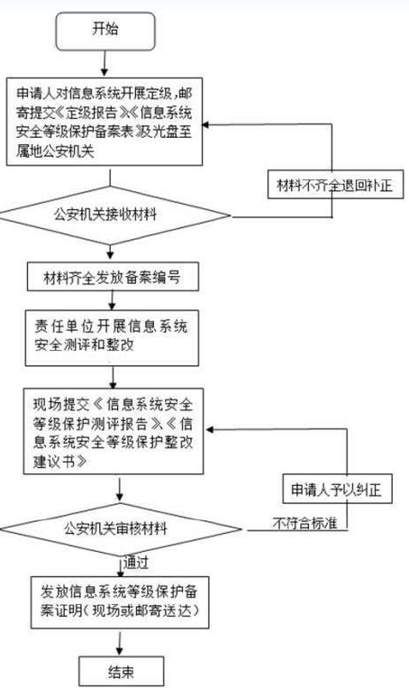
		- 备案地点
			- **二级以上信息系统**(地市级以上公安机关网络安全保卫部门)
			- 隶属于**省级的备案**单位：省级公安机关网络安全保卫部门
			- 隶属于中央的**在京**单位：公安部
			- **跨省或者全国统一联网运行**的信息系统：所在地地市级以上公安机关网络安全保卫部门
			- **各部委**统一定级信息系统在各地的分支系统：也要到当地公安网络安全保卫部门备案
	- 建设整改
		- **使确定了等级的信息系统能够达到相应等级的基本保护水平和满足自身需求的安全保护能力。**
	-
- ## 6.物理安全
  collapsed:: true
  {{renderer :wordcount_675a5dfa-132a-4be5-9aff-7a918bf43234}}
	- ### 物理安全体系
		- **物理安全概念:**又叫实体安全， 保护计算机网络设备、设施以及其它媒体免遭地震、水灾、火灾等环境事故以及人为操作失误或错误及各种计算机犯罪行为导致的破坏过程。
		- 线路安全、介质安全、设备安全、环境安全、电源安全
	- **环境安全**
	  background-color:: red
		- 防火，防盗，防水，防鼠，防尘
		- 实验室消防使用**==七氟丙烷==**（必考！）
		- 环境安全三要素: 温度（18-22度）, 湿度（40%-60%为宜）, 洁净度（尘埃颗粒直径<0.5m，含尘量<1万颗/升）
		- ### 机房的三度要求
			- 温度、湿度和洁净度并称为三度，为保证计算机网络系统的正常运行，对机房内的三度都有明确的要求。为使机房内的三度达到规定的要求，空调系统、去湿机、除尘器是必不可少的设备。重要的计算机系统安放处还应配备专用的空调系统，它比公用的空调系统在加湿、除尘等方面有更高的要求。
		-
		- #### 防火与防水要求
			- 为避免火灾、水灾，应采取如下措施：
				- （1） 隔离
				- （2） 火灾报警系统
				- （3） 灭火设施
				- （4） 管理措施
			- 重要火灾隐患：UPS电池组
			  background-color:: red
		- #### 机房防盗要求：
			- ==视频监视系统==是一种更为可靠的防盗设备，能对计算机网络系统的外围环境、操作环境进行实时全程监控。对重要的机房，还应采取特别的防盗措施，如值班守卫、出入口安装金属探测装置等。
			- 在需要保护的重要设备、==存储媒体和硬件上贴上特殊标签==（如磁性 标签），当有人非法携带这些重要设备或物品外出时，检测器就会 发出报警信号。
			- 将每台重要的设备==通过光纤电缆串接起来==，并使光束沿光纤传输， 如果光束传输受阻，则自动报警。
			- **如何减少无关人员进入机房的机会是计算机机房设计时首先要考虑的问题**
			  background-color:: red
		- **机房防🐀**
		- ####  接地和防雷要求
		- **环境安全之四：防静电措施，接地要求**
			- ==接地可以为计算机系统的数字电路提供一个稳定的0V参考电位==，从而可以保证设备和人身的安全，同时也是防止电磁信息泄漏的有效手段。
			- 避免使用产生静电的材料，采用乙烯材料，==安装防静电地板==
			- 机房要保持一定==湿度==特别是在干燥季节
		- **环境安全之五：防雷击要求**：
			- 外部防雷雷应使用接闪器、引下线和接地装置
			- 内部防雷装置主要由等电位连接系统、共用接地系统、屏蔽系统、合理布线系统、电涌保护器
			  等几部分组成
		- **环境安全之六：机房选址要求**
			- • 避开发生火灾危险程度高的区域；
			  • 避开产生粉尘、油烟、有害气体源、以及存放腐蚀、易燃、易爆物品的地方；
			  • 避开低洼、潮湿、落雷、重盐害区域和地震频繁的地方；
			  • 避开强振动源和强噪音源；
			  • 避开强电磁场的干扰；
			  • 避免设在建筑物的高层或地下室，以及用水设备的下层或隔壁远离核辐射源；
			  • 计算机机房所在建筑物的结构安全。
	- 和外界的通信线路畅通
	  background-color:: green
	  collapsed:: true
		- 线路安全
			- 窃听
			- 搭线窃听
			- 光纤通信技术
				- 光纤通信线曾被认为是不可搭线窃听的，光纤没有电磁辐射所以也不能用电磁感应窃听
				- 光纤的最大长度有限制，长于这一长度的光纤系统必须定期地放大（复制）信号。==完成这一操作的设备（复制器）是光纤通信系统的安全薄弱环节==
			- 海底电缆窃听
	- 电力供应可靠，防雷击
	  background-color:: blue
	  collapsed:: true
		- 供电安全
		- 电源是计算机网络系统的命脉，**电源系统的稳定可靠**是计算机网络系统正常运行的先决条件
			- 电源系统电压的波动、浪涌电流和突然断电等意外情况的发生可能引起计算机系统存储信息的丢失、存储设备的损坏等情况的发生
			- 电源系统的安全是计算机系统物理安全的一个重要组成部分。
		- 供电安全三类供电
			- | 一类供电               | 二类供电               | 三类供电         |
			  | ---------------------- | ---------------------- | ---------------- |
			  | 需要建议不间断供电系统 | 需要建立备用的供电系统 | 一般用户供电考虑 |
		- 不间断电源UPS
	- 设备安全：电磁泄漏
	  collapsed:: true
		- 内存总线可成为辐射的天线
		- ### 概念
			- 电磁泄漏指电子设备的杂散电磁能量通过导线或空间向外扩散。
		- #### 产生的原理
			- 1） 电磁泄漏指电子设备的杂散电磁能量通过导线或空间向外扩散。
			- 2） 任何处于工作状态的电磁信息设备，都存在不同程度的电磁泄漏问题，这是无法摆脱的电磁现象。
			- 3） 如果这些泄漏“夹带”着设备所处理的信息，均可构成电磁信息泄漏。
		- ###  途径
			- 以电磁波形式的辐射泄漏
			- 电源线、控制线、信号线和地线造成的传导泄漏
			  
			  
		- ###  电磁泄露的防御方法
			- 1） 物理抑制技术：
				- 抑源法：从线路和元器件入手，**从根本上阻止计算机系统向外辐射电磁波**，消除产生较强电磁波的根源。
			- 2） 电磁屏蔽技术：
				- 电磁屏蔽技术包括设备的屏蔽和环境的屏蔽，它是从**阻断电磁信息泄漏源发射的角度**采取措施。
				- 主要指涉密计算机或系统被放置在**全封闭的电磁屏蔽室内**，其主要材料分别是金属板或金属网等。
			- 3） 噪声干扰技术：
				- 在**信道上增加噪声**，从而降低窃收系统的信噪比，使其**难以将泄露信息还原。**
	- #### 机房设计
		- 物理安全，知道设计一个机房要考虑哪儿些因素，遵循哪儿些标准，初步掌握了机房设计的本事
		- 可靠性设计，容错设计，配置RAID
		- 如果你牵头建设一个超级计算中心，有可能承担军事或者保密相关的计算任务，从物理安全的角度需要考虑哪些因素?
			- 物理安全：
				- （1） 环境安全：机房的三度要求、防火与防水、防盗、防鼠、防静电、接地与防雷、机房选址
				  
				  （2） 线路安全：窃听、搭线窃听、光纤通信技术、海底电缆窃听
				  
				  （3） 供电安全：三类供电方式、电源防护措施、接地与防雷
				  
				  （4） 设备安全：电磁泄漏
				  
				  （5） 介质安全：电磁战、防磁柜
			- **围栏和外围防护**：
				- 安装围栏和使用门禁系统来限制未经授权的物理访问。
			- **安全人员**：
				- 雇佣训练有素的安全人员进行24/7的监控和巡逻。
			- **监控系统**：
				- 使用闭路电视（CCTV）和其他监控设备来监控中心的内部和外部。
			- **入口控制**：
				- 实施严格的访客管理制度，包括身份验证、访客登记和陪同政策。
			- **抗自然灾害建筑设计**：
				- 设计建筑物以抵御地震、洪水、火灾等自然灾害
			- **电力供应安全**：
				- 确保有稳定的电力供应，包括备用发电机和不间断电源（UPS）系统。
			- **环境控制**：
				- 控制计算中心内的环境条件，包括温度、湿度和灰尘。
			- **防火措施**：
				- 安装高效的火灾探测和自动喷水灭火系统。
			- **数据和通讯线路保护**：
				- 保护数据线路免受窃听和物理损害。
			- **访问记录和审计**：
				- 记录所有访问数据中心的人员，并定期进行安全审计。
			- **运输安全**：
				- 确保敏感设备和数据的运输过程安全。
			- **废弃物处理**：
				- 确保废弃的硬件、纸张和其他可能包含敏感信息的物品被安全处理。
	-
- ## 7.可靠性基本概念
  collapsed:: true
  {{renderer :wordcount_675a5dfa-f4de-4228-81a1-dabc6c05a996}}
	- 
	- 可靠性的定义
		- 在==规定的条件==下，==给定的时间==内，系统能==实施应有功能==的能力。
		- 可靠性概念是用来研究如何发现故障、分析故障、应对故障的科学
	- 可靠性的参数：
	  background-color:: red
		- $T_{MTTF}$ 平均失效前时间
		  logseq.order-list-type:: number
		- $T_{MTBF}$平均故障间隔时间
		  logseq.order-list-type:: number
			- 两个T统称==寿命==
			- 寿命的计算方法：
			  collapsed:: true
				- 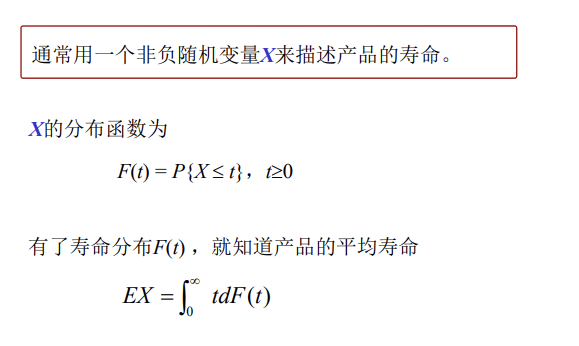
				- 寿命的不同定义：
					- 不可修系统：MTTF（Mean Time to Failure) 投入工作到失效前的时间。也叫平均失效前时间
					- 可修系统：MTBF(Mean Time Between Failures) 两次故障间的时间平均值。也叫平均无故障工作时间
		- R ==可靠度==
		  logseq.order-list-type:: number
		  collapsed:: true
			- 产品在时刻 t 之前都正常工作（不失效）的概率，即产品在时刻 t的生存概率，称为无故障工作概率（可靠度函数）
			- 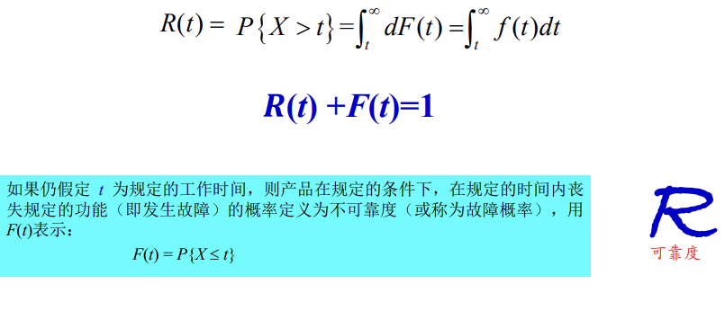
			- 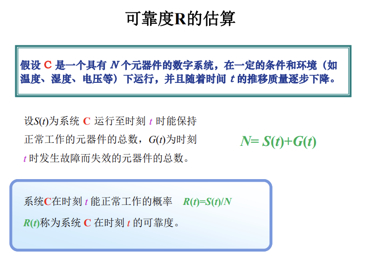
			- 准确算就是用积分把t到正无穷的概率分布积分出来
			- 估算直接除法
		- \lambda ==失效率==
		  logseq.order-list-type:: number
		  collapsed:: true
			- 
			- \lambda(t)的浴缸形曲线（Bathtub-curve）
				- 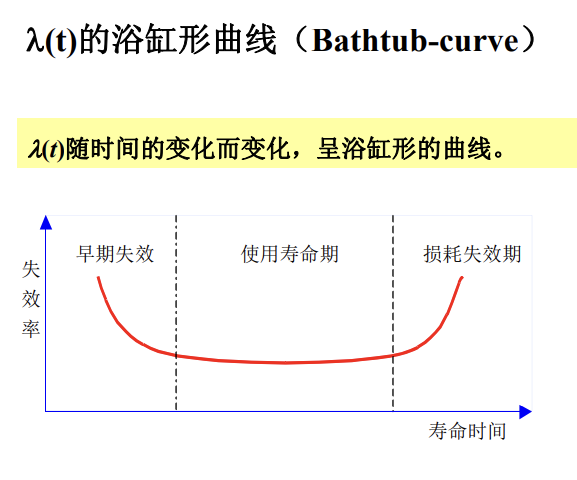
				- 第一阶段 早期失效期（Infant Mortality)
					- 开始时失效率高，随着产品工作时间的增加，失效率迅速降低。
					- 原因是设计、原材料和制作过程中的缺陷
					- 为了缩短这一时间应该运行前进行试运转来提早发现；或者试验筛选不合格的
				- 第二阶段 偶然失效期，也称随机失效期（Random Failures）
					- 这一阶段的特点是失效率较低，且较稳定，往往可近似看作常数。这一时期是产品的良好使用阶段。
					  由于在这一阶段中，产品失效率近似为一常数，故设 \lambda(t)=λ（常数）由可靠度计算公式得$R(t)=e^{-\lambda t}$
					- **这一式表明设备的可靠性与失效率成指数关系。**
					  background-color:: red
				- 第三阶段 耗损失效期（Wearout）
					- 该阶段的失效率随时间的延长而急速增加，主要原因是器件的损
					  失己非常的严重，寿命快到尽头了，可适当的维修或直接更换
		- **R(t)和\lambda的关系**
		  background-color:: red
			- 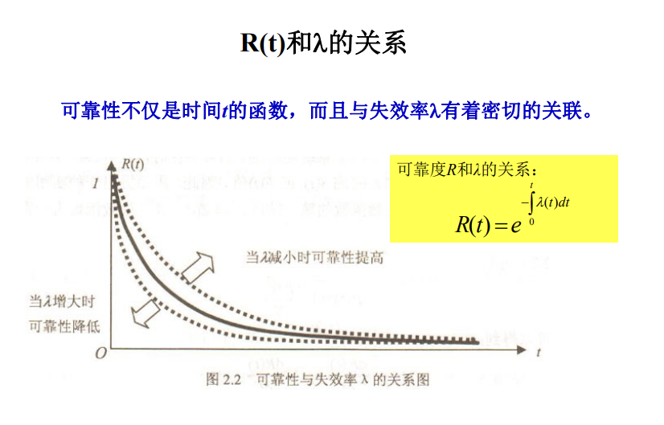
			-
	- ####  不可维修产品
	  collapsed:: true
		- 我们把==MTTF作为不可维修产品的可靠性指标==
		- 系统的可靠性越高，平均无故障时间越长
	- ####  可维修产品
		- **可维护性度量指标**
			- 可维修产品的==可维护性度量指标：平均维修时间（MTTR，Mean Time To Repair）==
			- 即系统发生故障后维修和重新恢复正常运行平均花费的时间（即设备处于故障状态时间的平均值，或设备修复时间的平均值）。==系统的可维护性越好，平均维修时间越短。==
			- $$
			  MTTR=\int_0^\infty t\mu(t)dt
			  $$
			- 其中：\mu(t)是维修时间的概率密度函数。
		- **可靠性指标**（跟上面一个不太一样）
			- 对**可维修产品**而言，其平均寿命是指两次故障间的时间平均值，称平均故障间隔时间，习惯称平均无故障工作时间 ==MTBF （Mean Time Between Failures ）==。
			- 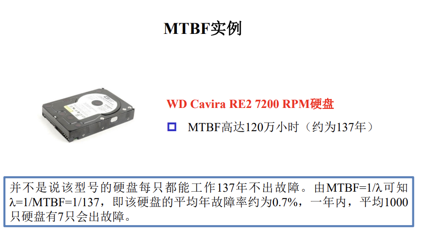
			- 不是很理解上面的例子，但是想了一下那个图，发现这里其实就是把他当成串联系统里面那个计算方式了
				- 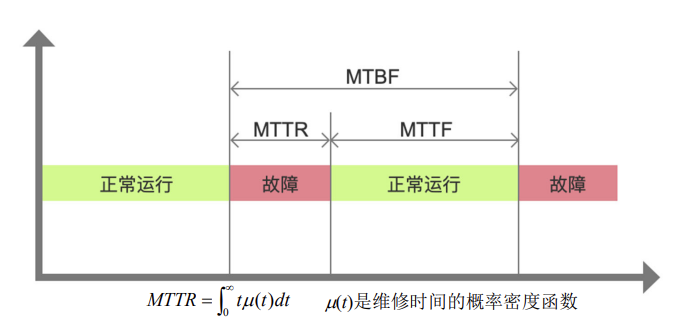
		- ==可维修产品的维修性指标：可用性==（什么勾8这么多定义）
			- $$
			  \frac{MTBF}{MTBF+MTTR}\times100\%
			  $$
			- 产品的可用性定义为系统保持正常运行时间的百分比，他表示设备处于完好状态的概率
			  background-color:: pink
		- 可维修产品的可维护性平均维修时间（MTTR，Mean Time To Repair）来度量
	- ==**公式集合（必考）**==
		- | 概念 | 公式 |
		  | ---- | ---- | ---- |
		  | 寿命分布函数F(t) | $F(t)=P\{X\leq t\}\text{,}t\geq0$ |
		  | 平均寿命E(X) | $E(X)=\int_0^\infty tdF(t)=\int_0^\infty tf(t)dt$ |
		  | 无故障工作概率/可靠度函数R(t) | $R(t)=P\left\{X>t\right\}=\int_t^\infty dF(t)=\int_t^\infty f(t)dt$ |
		  | 失效率\lambda | $P\big\{X<t+\Delta t\mid X>t\big\}=\frac{F(t+\Delta t)-F(t)}{R(t)}\\\approx\frac{f(t)}{R(t)}\Delta t,\:\Delta t\to0$ <br /> $\lambda(t)=\frac{f(t)}{R(t)}=-\frac{R^{'}(t)}{R(t)}$|
		  |补充| $R(t)=e^{\large-\int_0^t\lambda(t)dt}=e^{-\lambda t}$ $MTTF/MTBF=\frac{1}{\lambda}$|
	- ### 系统可靠性模型（大头）
		- #### 串联
		  collapsed:: true
			- 系统由n个部件串联而成，任一部件失效就引起系统失效
			- 当$R_t(t)=e^{-\lambda _i t},\quad i=1,2,\ldots,n$时
				- 系统的可靠度和平均寿命:
				- $R(t)=\exp\left\{-\sum_{i=1}^n\lambda_it\right\}$
				  $MTTF=1/\sum_{i=1}^n\lambda_i$
				- 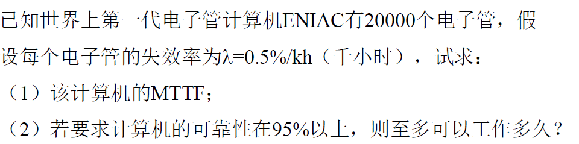
				- 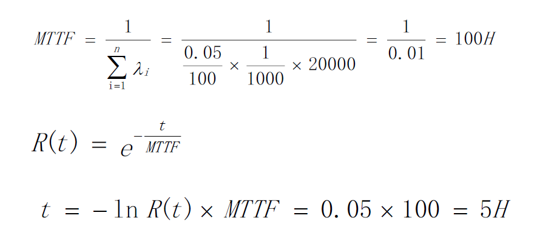
		- #### 并联
			- ​​​​当$R_t(t)=e^{-\lambda_it},\quad i=1,2,\ldots,n$时
			  系统的可靠度R(t)和平均寿命为：
			  \begin{aligned}
			  R(t)& =P\bigl\{\max\bigl(X_1,X_2,\cdots,X_n\bigr){>}t\bigr\}  \\
			  &=1-P\{\max(X_1,X_2,\cdots,X_n){\leq}t\} \\
			  &=1-\prod_{i=1}^n[1-R_i(t)]
			  \end{aligned}
			- 系统的寿命是： X=max{X1，X2 ，…，Xn}
			- 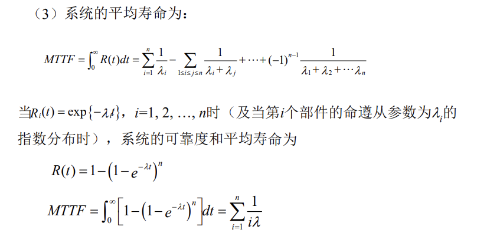
			- 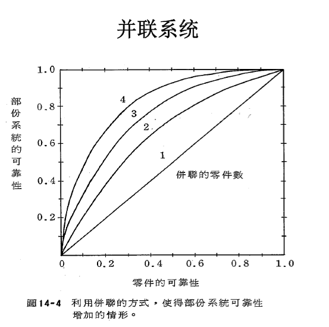
		- 表决系统
			- 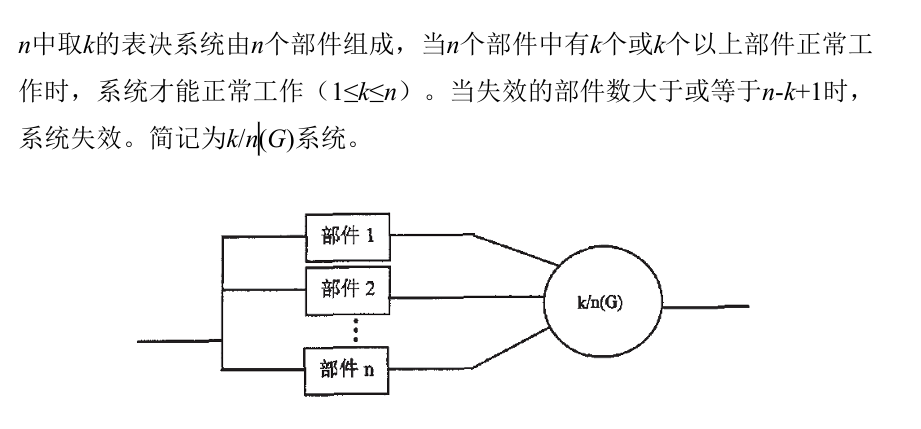
		- 冷贮备系统
			- 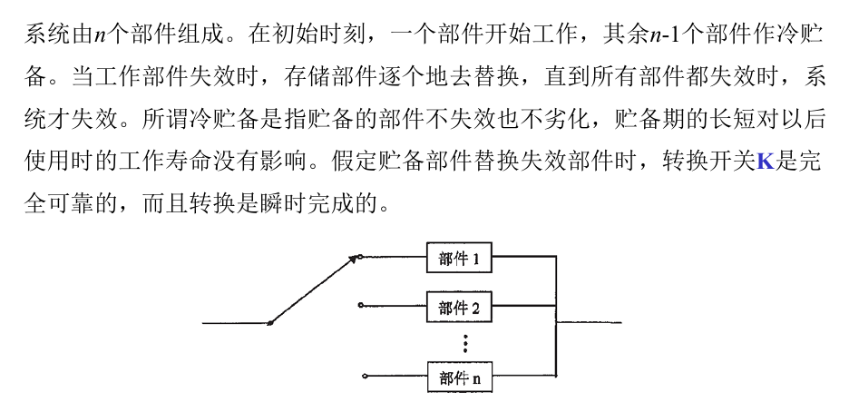
	-
- ## 8.可靠性2
  collapsed:: true
  {{renderer :wordcount_675a5dfa-0da7-431a-ba8f-5022c7406630}}
	- ###  硬件可靠性和软件可靠性
		- 定义和本质
		  collapsed:: true
			- 硬件可靠性：硬件组件在特定条件和时间内正常运行的概率
			- 软件可靠性：
				- 在指定条件下使用时，软件产品维持规定的性能级别的能力。
				- 另一种：在规定条件下、规定时间内，软件不引起系统失效的概率；
				  在规定时间周期内所述条件下程序执行所要求的功能的能力。
			- ==**失效模式**==：
				- **硬件失效**：通常是由于==物理磨损==、材料老化、环境因素等原因造成的。
				- **软件失效**：通常是由于==编程错误==、设计缺陷、不兼容性或者外部输入数据的异常等原因造成的。
		- ### 硬件可靠性
			- 提高硬件可靠性的方法
			  collapsed:: true
				- 设计：结构优化、功能合理
					- 只要能满足系统的性能指标，就应尽可能地==**简化**==系统结构，减少元件的数量，简化方案
					- ==**避免**==片面追求高性能和过多的功能
					- 合理==**划分软硬件功能**==，能用软件完成的功能就用软件
					- 抗干扰设计：干扰源、传输途径及干扰对象是构成干扰的三个要素。
						- 合理接地、屏蔽、隔离、长线传输、电源干扰的抑制等手段。
					- ==冗余设计==
						- 故障容错是利用冗余的元部件来屏蔽已发生的故障对系统的影响。
						- 可分为：
							- 并联系统（就是元器件并联）
							- 备用系统（每一个线路上串联，但是总的来说是并联的）
							- 表决系统
								- 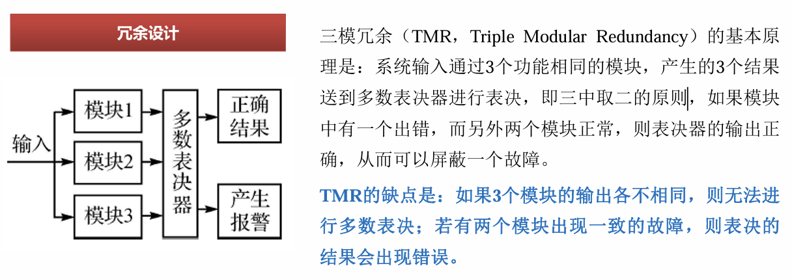
								- 应用案例：FPGA
								- ==三模冗余改进==上课提过
									- 使用不同来源的模块设计（异构冗余）**：
										- 采用不同设计或不同制造商的模块，减少因设计或制造缺陷而导致的共模故障。
									- **增加错误检测和诊断能力**：
										- 增强每个模块的自检测功能，使其能在出现故障时自动隔离自己，减少错误传播的风险。
									- **采用动态重配置技术**：
										- 当检测到模块故障时，自动重配置系统，替换故障模块，确保系统始终保持在冗余状态。
									- **增加更多的冗余模块**（例如 N 模冗余）：
										- 使用更多的模块进行表决，例如五模冗余（5MR），提高系统对多个故障的容忍度。
				- 环境：符合相关的标准和要求
					- 温度变化会影响电容、电阻、半导体、功耗
					- 湿度高了会导致漏电耦合，低了会导致静电
					- 电压
						- 隔离器、稳压器、滤波器
					- 振动、冲击：
						- 导致元器件加速失效
						- 焊点、压线点松动，接触不良
						- 不应有的碰连
				- 使用：符合操作规程、减少人为失误
					- 人为失误是任何超过系统正常工作所能接受的标准与范围的人的行
					  为与动作
					-
		- ### 软件可靠性
		  collapsed:: true
			- 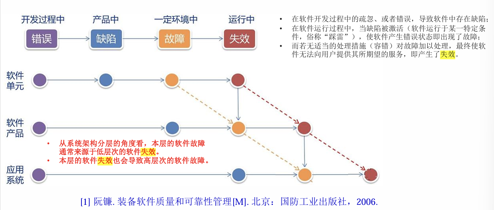
			- ### 如何提高软件可靠性
				- 软件检测技术
				- AI技术
			- ### 1软件可靠性建模
				- 失效时间间隔模型
				  background-color:: red
					- 把**失效间隔时间**看作随机过程, 然后通过适当的**时间序列模型**来分析和描述软件的失效过程 。
					- 失效时间作为随机过程, 时间序列模型描述
					- 书上例子是Jelinski-Moranda模型
				- 缺陷计数模型
				  background-color:: pink
					- 这类模型关心的是在==特定的时间间隔内软件的错误数或失效数==
					- 当时间间隔事先确定时 在每个间隔时间内的失效次数就是随机变量
						- Shooman模型、Musa的执行时间模型
				- 错误植入模型
				  background-color:: green
					- 通过将一组已知的错误人为地植入到一个固有错误总数尚不清楚的程序中, 然后在程序的测试中观察并统计发现的植入错误数和程序总的错误数, 通过计数的比值估计程序的固有错误总数, 从而得到软件可靠度及其有关指标。
					- 有点像生物里面计算种群数量的方法
					- 人为植入已知错误不清楚的程序，计算植入错误和总错误, 计数的比值估计程序的固有错误总数
					  background-color:: red
					- Mills的超几何分布模型
				- 基于输入域的模型
				  background-color:: purple
					- 据程序的使用情况, 找出程序可能输入的概率分布 根据这种分布产生一个测试用例的集合 。
					- 由于得到输入的分布难度较大一般将输入域划分成等价类, 每个等价类与程序的一条执行路径相联.
					- 在输入域上随机抽取测试用例, 执行相应的程序测试, 观测故障, 从而推断出各项指标 。
					- 得到输入分布集合, 输入域随机抽取测试用例, 观测故障, 推断各项指标
					  background-color:: purple
					- Nelson模型为代表。
				- 影响软件可靠性的主要因素
					- 软件开发方法和开发环境
					  logseq.order-list-type:: number
					- 运行环境
					  logseq.order-list-type:: number
					- 软件规模
					  logseq.order-list-type:: number
					- 软件内部结构
					  logseq.order-list-type:: number
					- 软件的可靠性投入
					  logseq.order-list-type:: number
					- 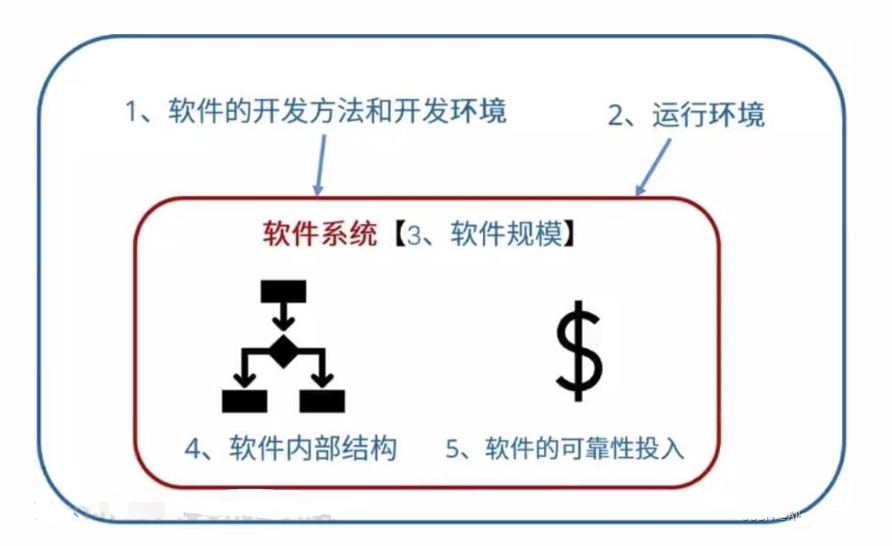
			- ### 2软件的可靠性设计技术
				- 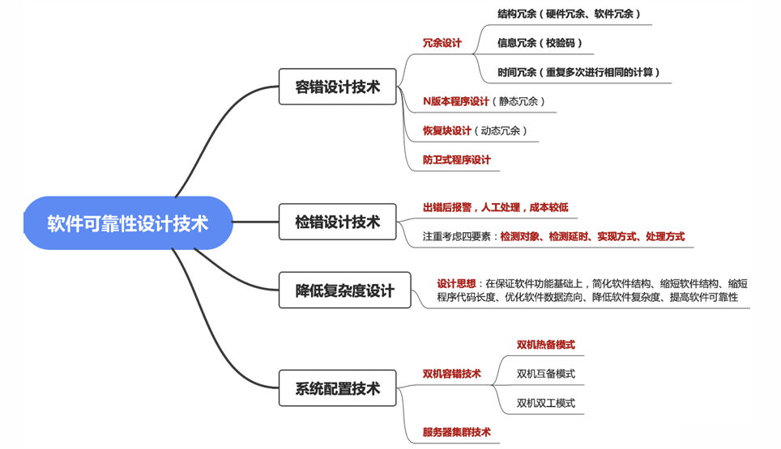{:height 315, :width 534}
				  id:: 675be98a-e9e4-48f8-a528-447e1787c2e9
				- #### 软件的可靠性容错技术
					- 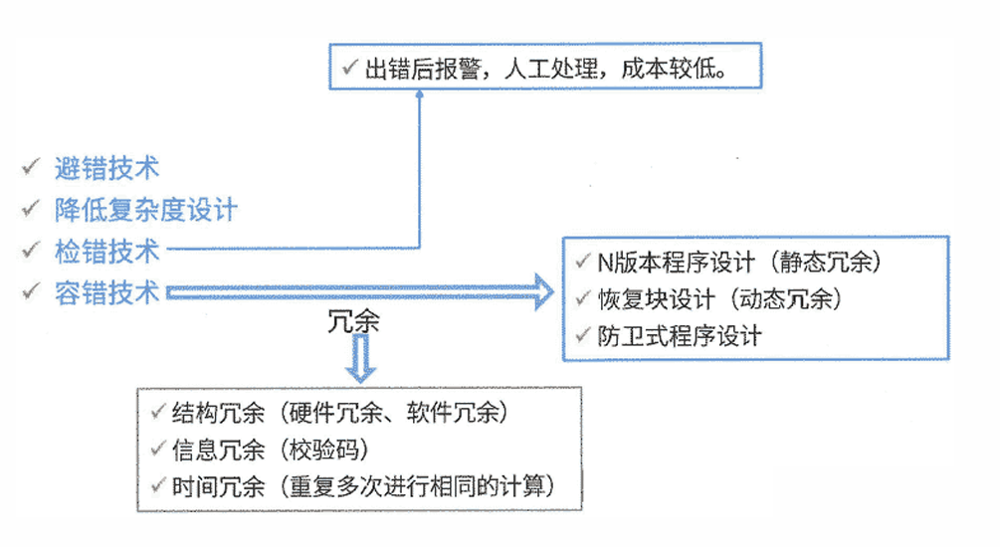
			- ### 3软件可靠性测试
			  collapsed:: true
				- 软件可靠性测试与传统意义上的软件测试不同：
					- 传统软件测试模型的建立主要是通过预测和估计得出的，不能如
					  实地反映系统的真实情况。
					- 软件可靠性测试是统计测试思想在软件可靠性度量上的应用，要
					  求==测试按照软件的操作剖面进行，测试结果使用软件可靠性模型
					  进行评价，其中操作剖面的构造是进行可靠性测试的基础==。
				- 操作剖面是对软件使用方式的数值描述，可以理解为各种使用方式
				  的使用概率。它可定量地描述软件的实际使用情况
					- 例如：客户破面、用户剖面、系统模式剖面、功能剖面、操作剖面
				- 一般过程
					- 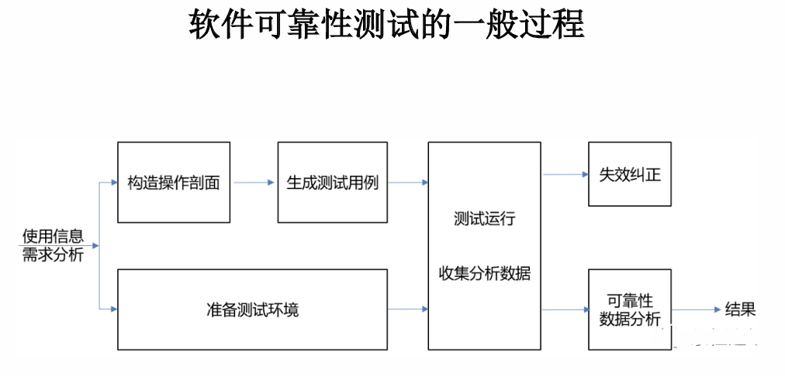
				- 例题：
					- 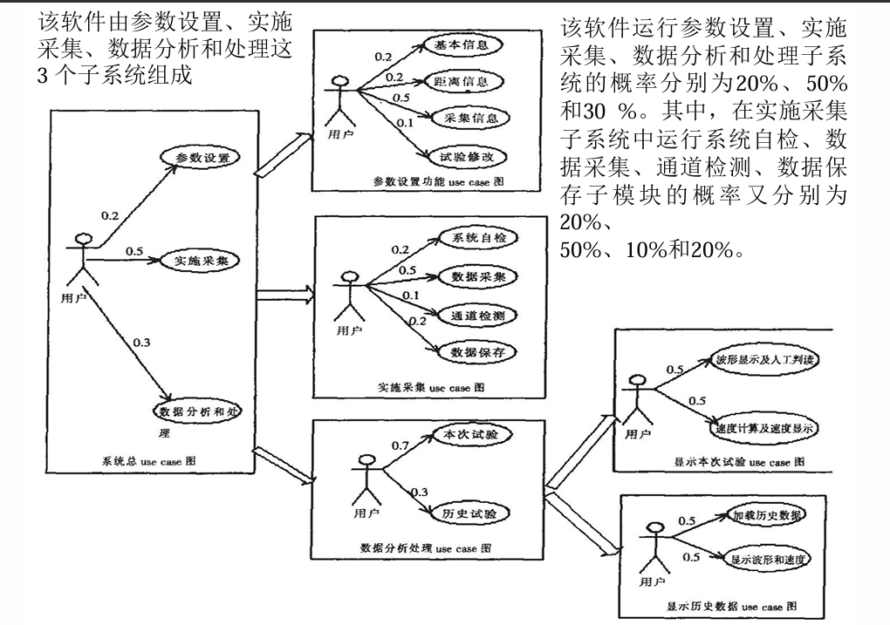{:height 363, :width 504}
					- 
					- 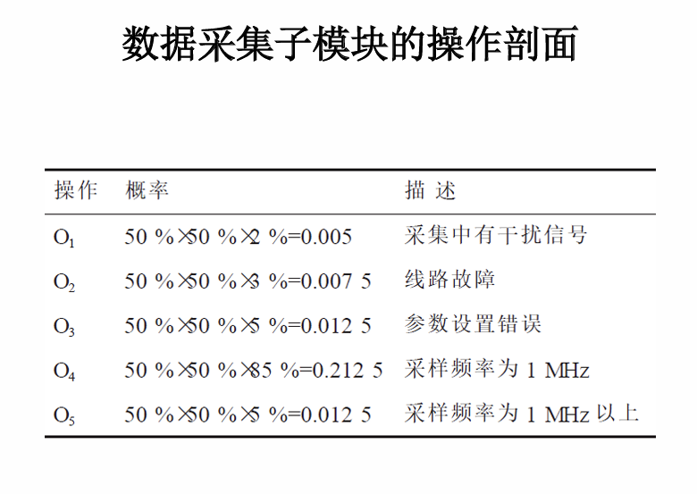
				-
					-
			- ### 4软件可靠性管理
				- 软件可靠性管理是软件工程管理的一部分，它以**全面提高和保证软件可靠性**为目标，以软件可靠性活动为主要对象，是==把现代管理理论用于软件生命周期中==的可靠性保障活动的一种管理形式。软件可靠性管理的内容包括软件工程各个阶段的可靠性活动的目标、计划、进度、任务和修正措施等。
				- 软件可靠性管理阶段可分为（大概看看）
					- 需求分析
					  logseq.order-list-type:: number
						- 确定可靠性目标和影响因素
					- 概要设计
					  logseq.order-list-type:: number
						- 确定可靠性度量、制定详细验收方案
					- 详细设计
					  logseq.order-list-type:: number
						- 可靠性设计、预测、调整计划、收集数据、明确后续阶段详细计划、编制文档。
					- 编码阶段
					  logseq.order-list-type:: number
						- 可靠性测试（单元)、排错、调整计划
					- 测试阶段
					  logseq.order-list-type:: number
						- 可靠性测试（集成和系统)、排错、可靠性建模、评价
					- 实施阶段
					  logseq.order-list-type:: number
						- 可靠性测试（验收）、排错、收集数据、调整模型
		- ### 网络可靠性
			- #### 定义
				- 在人为或自然的破坏作用下网络, 在特定环境和规定时间内, 充分完成规定的通信功能的能力 .
			- 三要素: 环境 、 时间和充分完成功能
			- #### 指标体系
				- 连通可靠性, 及时可靠性, 完整可靠性, 正确可靠性
			- 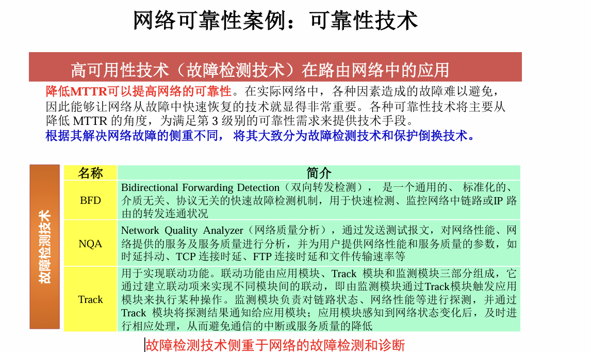
			- 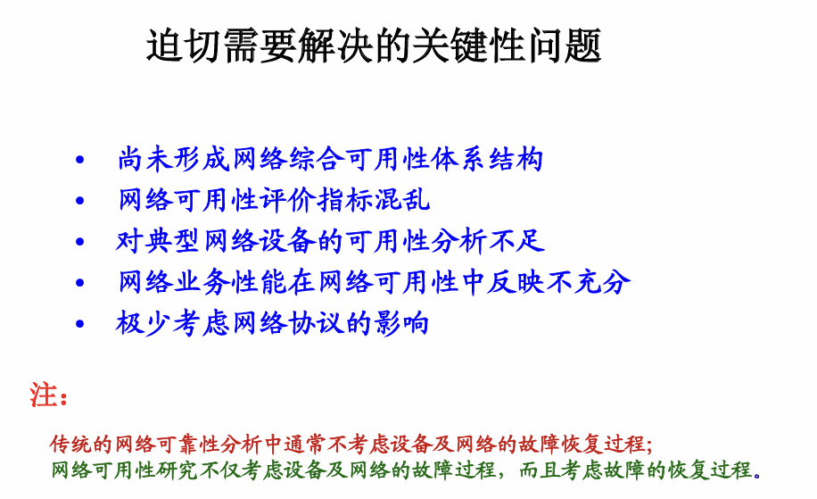
	-
- ## 9.可靠性3
	-