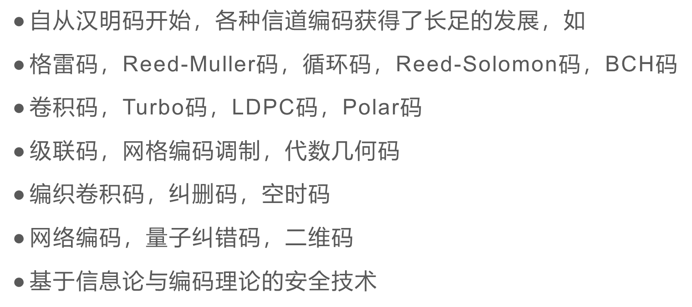

- 根据样题来看的话，跟复杂网络差不多，大多数是概念题和ppt有的，计算题也只考了书上的
  {{renderer :toc_675c091a-f736-4e4d-8aee-446abf866a9e}}
	- ## 一 概论 没有计算题
	  概念有：发展历程、编码机制、
		- 名人事迹翻ppt吧
		- 
		- ### 编码机制
			- 编码：信息从一种形式或格式转换为另一种形式的过程
			- 编码机制：用预先规定的方法将文字、数字或其他对象编码成数码，或将信息、数据转换成规定的电脉冲信号。
		- ### 信源编码
			- 目的：提高通信的有效性，用更少的符号来表示更多的信息
			- 设计机制：根据消息符号序列的统计特性来设计各种方法，把消息序列变换为较短的码字序列，同时又能保证无失真地恢复原来的消息序列
			  （减少消息符号序列中的冗余度，提高平均信息量）
			- 信源编码就是常说的数据压缩
		- ### 随机错误
			- 随机错误：接收序列中的传输错误是随机出现的
			- 随机错误信道：这样的信道称为随机错误信道
			- 常见于无记忆信道中，因为噪声随机独立地影响每个传输信号。
			- 深空通信和卫星通信信道都是典型的随机错误信道
		-
		-