- 
- 虽然xjy写了很多但是还是缺少些
- ## 一 复杂度计算（必考数学计算题）
	- 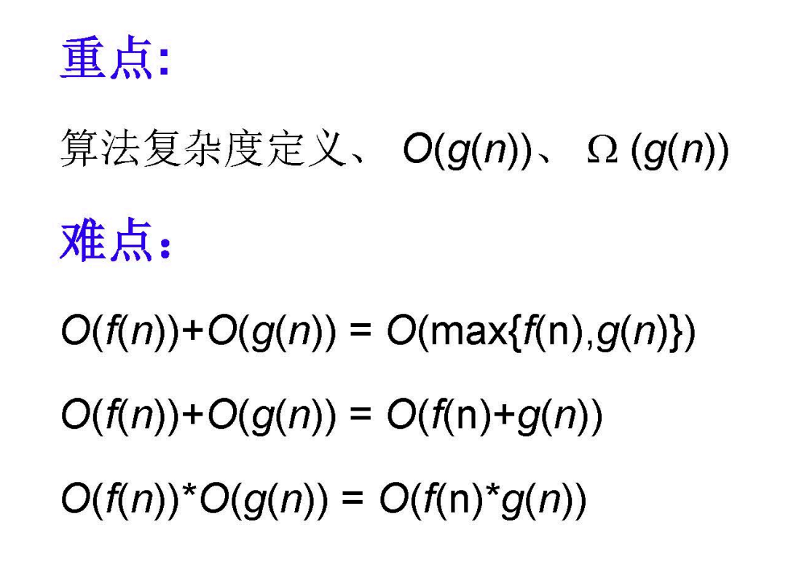
	  id:: 675fd779-36d0-4a27-a21d-427d79b52744
	- 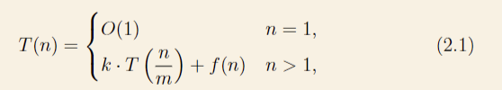{:height 106, :width 549}
	- 最烦计算题（但是没办法只能写）
	- CHATGPT回答：
		- 您给出的递归方程的形式大致如下：
		  \begin{cases}
		  O(1) & \text{当 } n=1, \\[6pt]
		  k \cdot T\left(\frac{n}{m}\right) + f(n) & \text{当 } n > 1.
		  \end{cases}
		- 这里的参数 k 与 m 是常数，且通常 $$ \geq 1, m > 1$$ 。函数 f(n) 则描述了合并步骤（或额外计算步骤）的复杂度。
		- 这类递归方程求解最常用的方法是**主定理（Master Theorem）**。主定理的标准形式一般是：$$T(n) = a T\left(\frac{n}{b}\right) + g(n)$$
		  其中 $$a \geq 1, b > 1$$ 均为常数，与您给出的方程中 a=k、b = m 对应，而 g(n)=f(n) 对应。
		- 主定理根据 g(n) 与 $$n^{\log_b a}$$ 的大小关系给出三种情形：
			- **如果** $$f(n) = O(n^{\log_m k - \epsilon})$$ 对于某个 \epsilon > 0，即 f(n) 的增长速度比 $$n^{\log_m k}$$ 慢，那么
			  $$T(n) = \Theta(n^{\log_m k}).$$
			- **如果** $$f(n) = \Theta(n^{\log_m k} \log^r n)$$ 对于某个 $$r \ge 0$$，即 f(n) 的增长速度与 $$n^{\log_m k}$$ 相同量级（可能再乘上一些 $$\log$$ 次幂），那么
			  
			  $$T(n) = \Theta(n^{\log_m k} \log^{r+1} n).$$
			  
			  特别地，如果 $$f(n) = \Theta(n^{\log_m k})$$，则
			  $$T(n) = \Theta(n^{\log_m k} \log n).$$
			- **如果**$$f(n) = \Omega(n^{\log_m k + \epsilon})$$对于某个 $$\epsilon > 0$$，也就是 f(n) 的增长速度比 $$n^{\log_m k} $$快，那么需要检查正则性条件（regularity condition），即：
			  $$k f\left(\frac{n}{m}\right) \leq c f(n)$$
			  
			  对于某个常数 c<1c < 1。若该条件满足，则
			  
			  $$T(n) = \Theta(f(n)).$$
			  
			  总结而言，解决这类递归方程的关键是通过比较 f(n)f(n) 与 nlog⁡mkn^{\log_m k} 的增长速率，然后套用主定理的三种情况求出 T(n)T(n) 的渐进复杂度。
		- 在使用主定理（Master Theorem）求解形如：
		- $$T(n) = a T\left(\frac{n}{b}\right) + g(n)$$
		- 的递归式时，我们比较的标准函数是 $n^{\log_b a}$。之所以选择这一函数作为比较基准，原因在于：
		- **递归的“分解结构”**：
			- 递归式 $$T\left(\frac{n}{b}\right) + g(n) $$描述了一种分治型算法。这里的参数 a 和 b 决定了问题的分解方式：
				- b > 1 表示每次将问题规模缩小到原来的 $$1/b$$。
				- a≥1 表示每次产生 a 个子问题。
			- 在没有额外的合并开销（即 g(n)=0g(n)=0）的纯递归情形下，递归解大致会呈现如下形式：
			  $$T(n) = a T\left(\frac{n}{b}\right) \implies T(n) = a \cdot a T\left(\frac{n}{b^2}\right) = \dots = a^{\log_b n} T(1)$$
			- 因为在每次递归中，问题规模从 n 缩小到 n/b，再到 $$n/b^2$$ ... 一共会进行约 $$n\log_b n$$ 次分解。当最终规模降到常数时 T(1)=O(1)，则有：$$T(n) \approx a^{\log_b n} = n^{\log_b a}.$$
			- 由此可知，当没有合并开销（或合并开销很小）时，递归的解是 $$n^{\log_b a}$$。这就是为什么 $$n^{\log_b a}$$ 自然成为一个分水岭或基准函数。
		- 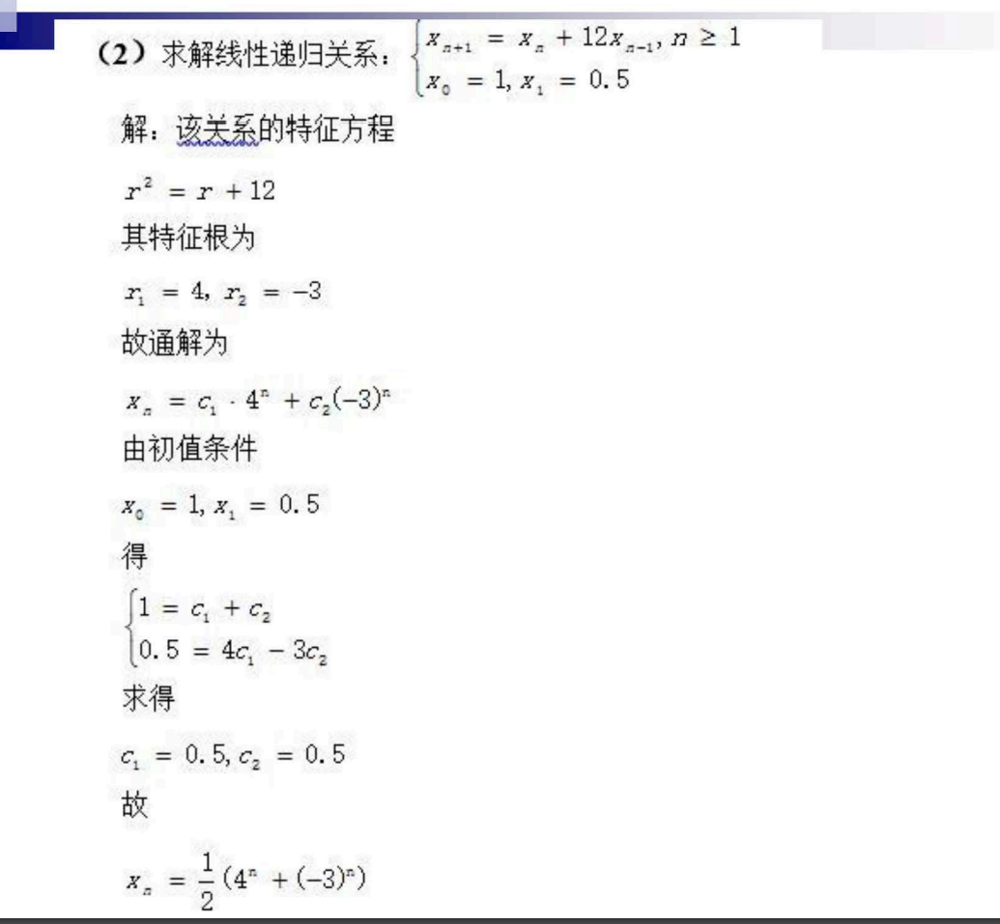
	-
- ## 二 递归与分治 8个案例
	- 递归的要素：边界条件和递归方程
	- 分治法复杂性分析：
		- 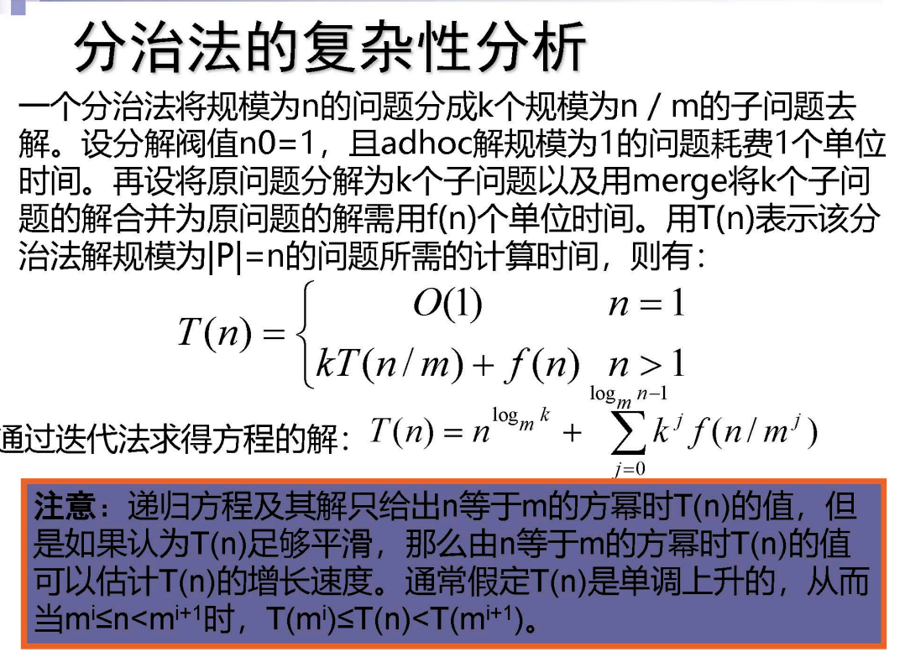
	- ### 汉诺塔问题
		- ```c++
		  void hanoi(int n,int a, int b, int c){
		    if(n > 0){
		      hanoi(n-1, a, c, b); // 把最底下的经过b放到c上面去
		      move(a,b);	// 把a最底下的放到b上去
		      hanoi(n-1,c,b,a); // 再把c柱子上排好的放b
		    }
		  }
		  ```
	- ### 二分搜索
		- 给定已按升序排好序的n个元素a[0:n-1],在其中找出一个特定元素x
		- 分析：
			- 缩小到一定程度可以容易解决
			- 可以分解为若干个规模较小的相同问题
			- 分解出的子问题的解可以合并为原问题的解
			- 分解出的各个子问题是相互独立的
		- ```c++
		  template <class Type>
		  int BinarySearch(Type a[],const Type &x, int l,int r)
		  {
		    while (r >= l){
		      int m = (l+r) / 2;
		      if (x == a[m]) return m;
		      if (x < a[m]) r = m - 1;
		      else l = m + 1;
		    }
		    return -1; //不在里面
		  }
		  
		  ```
	- 大整数除法
	- Strassen 矩阵乘法
	- 棋盘覆盖
		- ```c++
		  void ChessBoard(int tr, int tc, int dr, int dc,int size){
		    if(size == 1)
		      return;
		    int t = tile++; // 
		    s = size / 2; // 分成四块
		    // 覆盖左上角子棋盘
		    if（ dr < tr+s && dc < tc + s)
		      ChessBoard(tr,tc,dr,dc,s);
		    else{
		      Board[tr+s-1][tc+s-1]=t;	// 用t号L型骨牌覆盖右下角
		      ChessBoard(tr,tc,tr+s-1,tc+s-1,s); // 递归处理这个子块
		    }
		    if ( dr<tr+s && dc >= tc + s )
		      ChessBoard(tr, tc+s,dr,dc,s);
		    else{
		      Board[tr+s-1][tc+s] = t;
		      ChessBoard(tr,tc+s,tr+s-1,tc+s,s);
		    }
		    ...
		  }
		  ```
		- 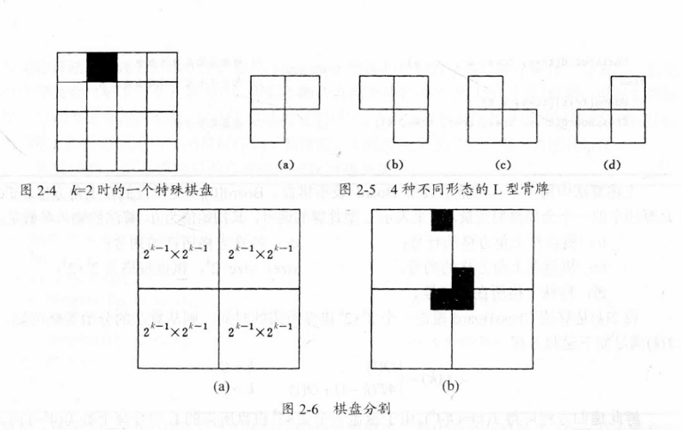
	- 合并排序
		- 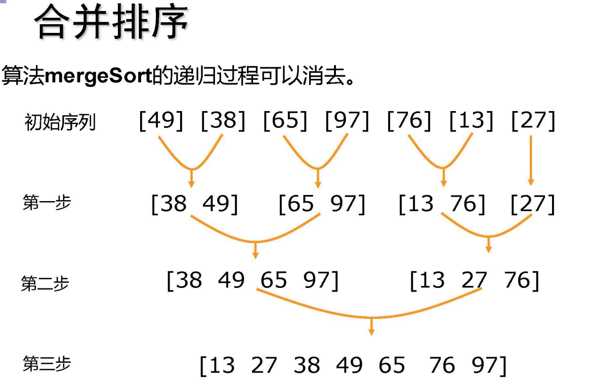{:height 287, :width 426}
		- 递归描述：
			- ```c++
			  template <class Type>
			  void MergeSort(Type a[],int left, int right)
			  {
			    if(left < right){
			      int i = (left + right) / 2;
			      MergeSort(a,left,i);
			      MergeSort(a,i+1,right);
			      Merge(a,b,left,i,right); 
			      Copy(a,b,left,right);
			    }
			  }
			  
			  void Merge(Type c[], Type d[], int l, int m, int r)
			  {
			    int i = 1, j = m +1 , k =1;
			    while ((i<=m) && (j<=r)){
			      if (c[i] <= c[j]) d[k++]=c[i++];
			      else d[k++] = c[j++];
			    if(i>m){
			        for(int q=j;q<=r;q++) d[k++] = c[q]
			      }
			    else{
			        for(int q=i;q<=m;q++)
			          d[k++] = c[q];
			      }
			    }
			  }
			  ```
		- 最优时间O(nlogn)
	- ### 快速排序
	  background-color:: red
		- ```c++
		  template <class Type>
		  void QuickSort(Type a[],int p,int r){
		  	if ( P < r ){
		      	int q = Partition(a,p,r);
		          QuickSort(a, p, q-1);
		          QuickSort(a, q+1, r);
		      }
		  }
		  
		  int Partition(Type a[],int p, int r){
		  	int i = p, j = r+1;
		      Type x = a[p];
		      // 将小于x的交换到左边区域，将大于x的交换到右边的区域，这里的复杂度是O（n）
		      while(true){
		      	while(a[++i] < x && i<r) ; // 从 i+1 开始
		          while(a[--j] > x);
		          if(i >= j)	break;
		          
		          Swap(a[i],a[j]);
		      }
		      a[p] = a[j]; // 最开始选的那个数字肯定要在中间
		      a[j] = x;
		      return j;
		  }
		  ```
		- 画图也可能考
			- 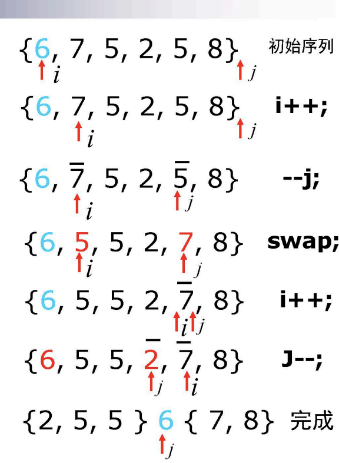
		- 性能：
			- 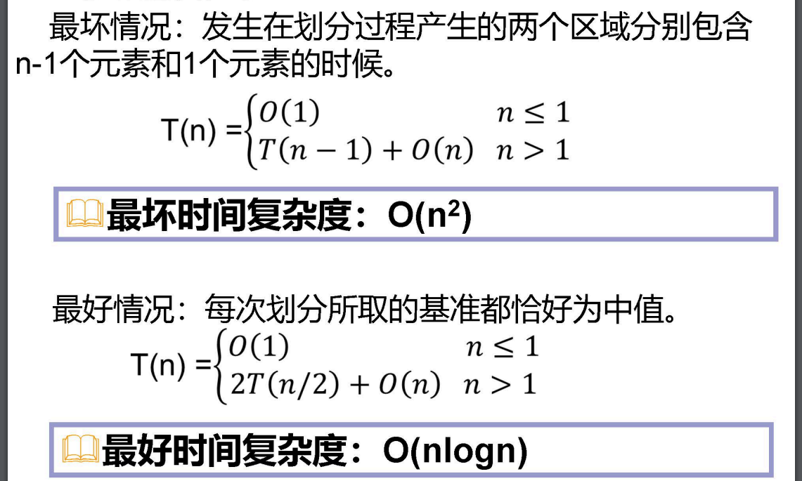
	- 线性时间选择
		- 接上面的快速排序：
			- 在最坏情况下，算法randomizedSelect需要O(n2)计算时间但可以证明，算法randomizedSelect可以在O(n)平均时间内找出n个输入元素中的第k小元素。
			- ```c++
			  template <class Type>
			  void RandomizedQuickSort(Type a[],int p,int r){
			  	if ( P < r ){
			      	int q = RandomizedPartition(a,p,r);
			          RandomizedQuickSort(a, p, q-1);
			          RandomizedQuickSort(a, q+1, r);
			      }
			  }
			  // 其实就是套了层壳
			  int RandomizedPartition(Type a[],int p, int r){
			  	int i = Random(p,r);
			      Swap(a[i],a[p]);
			      return Partition(a,p,r);
			  }
			  
			  int Partition(Type a[],int p, int r){
			  	int i = p, j = r+1;
			      Type x = a[p];
			      // 将小于x的交换到左边区域，将大于x的交换到右边的区域，这里的复杂度是O（n）
			      while(true){
			      	while(a[++i] < x && i<r) ; // 从 i+1 开始
			          while(a[--j] > x);
			          if(i >= j)	break;
			          
			          Swap(a[i],a[j]);
			      }
			      a[p] = a[j]; // 最开始选的那个数字肯定要在中间
			      a[j] = x;
			      return j;
			  }
			  
			  // 下面才是新的
			  Type RandomizedSelect(Type a[],int p, int r, int k)
			  {
			    if(p == r) return a[p]; // 就一个数字
			    int i = RandomizedPatition(a , p ,r );
			    j = i - p +1; // 计算左边数组的个数
			    if ( k <= j)
			      return RandomizedSelect(a[],p,i,k); // 还是左边的第 k 个
			    else
			      return RandomizedSelect(a[],i+1,r,k-j); // 右边的第 k-j 个
			  }
			  ```
		- 看看好了，这个太麻烦了
			- 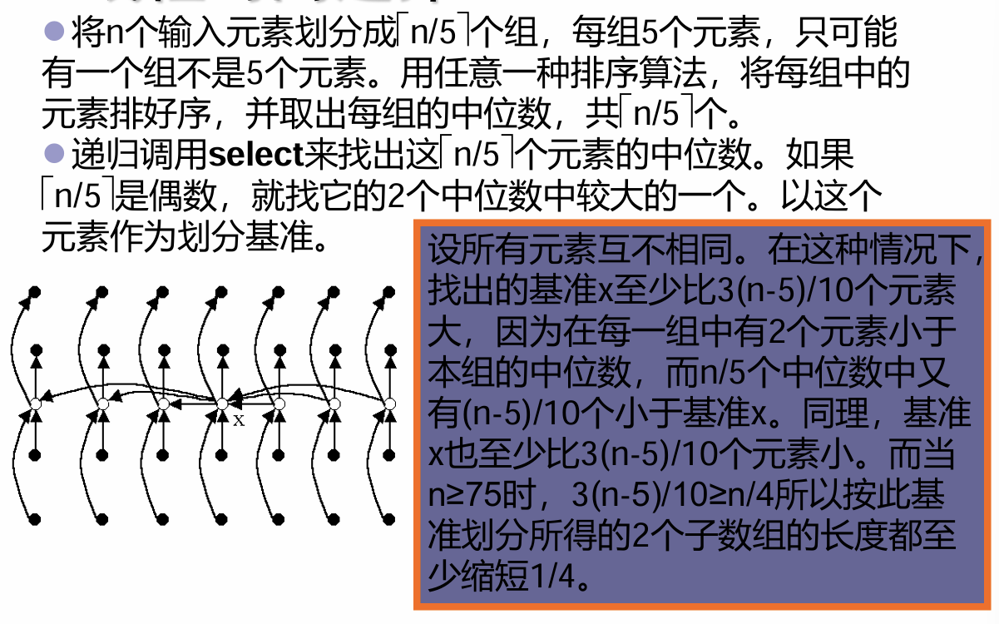
			- 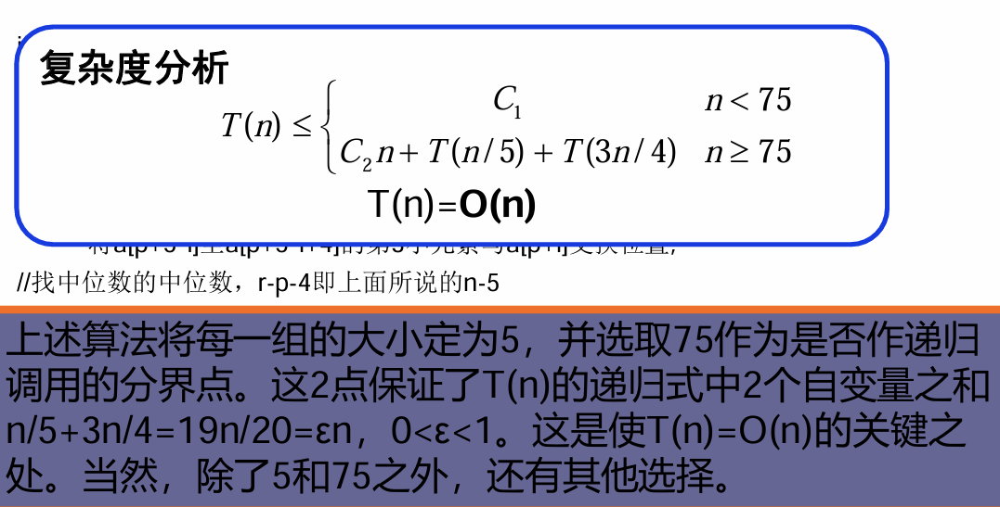
			- ```c++
			  Type Select(Type a[],int p,int r,int k)
			  {
			    if(r-p < 75){
			      用某个简单排序算法对数组a[p:r]排序;
			      return a[p+k-1];
			    }
			    for(int i=0;i <= (r-p-4)/5; i++){
			      // 看不太懂，可以不写，将a[p+5*i] 至a[p+5*i+4] 的第3小元素与a[p+i]交换位置；
			      Type x = Select(a,p,p+(r-p-4)/5,(r-p-4)/10); // 找中位数的中位数，r-p-4即上面所说的n-
			      int i = Partition(a,p,r,k);
			      int j = i-p+1;
			      if(k <= j)
			        return Select(a,p,i,k);
			      else
			        return Select(a,i+1,r,k-j);
			    }
			  }
			  ```
	- 最接近点对问题
		- 假设我们用x轴上某个点m将S划分为2个子集S1和S2 ，基
		  于平衡子问题的思想，用S中各点坐标的中位数来作分割点。
		- 递归地在S1和S2上找出其最接近点对{p1,p2}和{q1,q2}，并
		  设d=min{|p1-p2|,|q1-q2|}，S中的最接近点对或者是{p1,p2}，
		  或者是{q1,q2}，或者是某个{p3,q3}，其中p3∈S1且q3∈S2。
		- 能否在线性时间内找到p3,q3？
		- ```c++
		  bool Cpair1(S,d)
		  {
		    n = |S|;
		    if(n<2){
		      d = 正无穷;
		      return false;
		    }
		    m = S中各点坐标的中位数;
		    构造S1和S2;(S1 <= m, S2 > m)
		    Cpair1(S1,d1);
		    Cpair2(S2,d2);
		    p = max(S1);
		    q = min(S2);
		    d = min(d1.d2.q=[])
		  }
		  ```
	- 循环赛日程表
		- 有$n=2^k$个选手设计一个满足以下要求的比赛日程表：
		  (1)每个选手必须与其他n-1个选手各赛一次；
		  (2)每个选手一天只能赛一次；
		  (3)循环赛一共进行n-1天。
		- ```c++
		  void Table(int k, int **a)
		  {
		    int n = 1;
		    for(int i = 1;i<=k; i++)
		      n *= 2;
		    for(int i = 1;i<=n; i++)
		      a[1][i] = i;
		    int m = 1;
		    for(int s=1; s<=k; s++){
		      n /= 2;
		      for(int t=1; t<=n; s++){
		        for(int i=m+1; i<=2*m; i++){
		          for(int j=m+1; j<=2*m; j++){
		            a[i][j+(t-1)*m*2] = a[i-m][j+(t-1)*m*2-m];
		            a[i][j+(t-1)*m*2-m] = a[i-m][j+(t-1)*m*2];
		          }
		        }
		      }
		    }
		  }
		  ```
		-
- ## 三 动态规划 （重点）10个案例
  background-color:: red
	- 动态规划算法与分治法类似，其基本思想也是将待求解问题分解成若干个子问题
	- **基本步骤：**
		- 找出最优解的性质，并刻划其结构特征。
		- 递归地定义最优值。
		- 以自底向上的方式计算出最优值。
		- 根据计算最优值时得到的信息，构造最优解
	- 1 矩阵连乘
	  background-color:: pink
		- 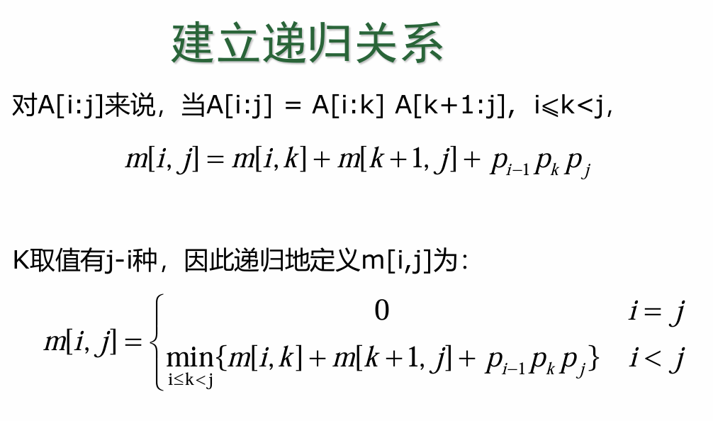
		- A[i:k]为 A[i]的行数 x A[k]的列数 的矩阵
		  A[i]的行 = A[i-1]的列 = p_{i-1}，A[k]的列数= p_{k}
			- 故：A[i:k] 为pi-1* pk的矩阵
			  A[k+1:j]为pk* pj的矩阵
		- 动态规划算法
		  
		  ```c++
		  void MatrixChain(int *p, int n, int **m, int **s)
		  {
		    for(int i=1;i <= n; i++)
		      m[i][j] = 0;
		    for(int r=2; r<=n; r++){
		      for (int i=1; i<= n-r+1; i++){
		        int j = i+r-1;
		        m[i][j] = m[i+1][j] + p[i-1]*p[i]*p[j];
		        s[i][j] = i; // 先默认第一个地方分开
		        for (int k = i+1; k<j; k++){ // 遍历所有可以分开的点
		          int t = m[i][k] + m[k+1][j] + p[i-1]*p[k]*p[j];
		          if( t < m[i][j]){
		            m[i][j] = t;
		            s[i][j] = k;
		          }
		        }
		      }
		    }
		  }
		  
		  void Traceback ( int i, int j, int **s )
		   {
		     if ( i == j )
		     return;
		     Traceback ( i, s[i][j], s);
		     Traceback ( s[i][j] + 1, j, s);
		     cout << “Multiply A”  << i << “,”  << s[ i, j ] ;
		     cout << “ and A “ << ( s[ i, j ] + 1 ) << “, “ << j << endl;
		   }
		  ```
		- 备忘录算法的递归是自顶向下。动态规划是自下向上
		  
		  ```c++
		  int MemorizedMatrixChain(int n, int **m, int **s)
		  {
		    for(int i=1; i <= n; i++){
		      for(int j=i; j<= n;j++){
		        m[i][j] = 0;
		      }
		      return LookupChain(1,n);
		    }
		  }
		  int LookupChain(int i,int j){
		    if(m[i][j] > 0)
		      return m[i][j];
		    if( i == j)
		      return 0;
		    int u = LookupChain(i,j) + LookupChain(i+1,j) + p[i-1]*p[i]*p[j];
		    s[i][j] = i;
		    for(int k=i+1;k < j; k++){
		      int t = LookupChain(i,k) + LookupChain(k+1,j) + p[i-1]*p[k]*p[j];
		      if(t < u){
		        u = t;
		        s[i][j] = k;
		      }
		    }
		    m[i][k]] = u;
		    return u;
		  }
		  ```
	- 2. 最长公共子序列
		- 给定序列X={x1,x2,…, xm}，另一序列Z={z1,z2,…, zm}。
		  若Z是X的子序列，是指存在一个严格递增下标序列
		  {i1,i2,…,ik}，使得对于所有j=1,2,…,k有：zj = xij 。
		  例如：序列Z={B，C，D，B}是序列X={A，B，C，B，D，A，B}的
		  子序列，相应的递增下标序列为{2，3，5，7}。
		  给定2个序列X和Y，当另一序列Z既是X的子序列又是Y的子序列
		  时，称Z是序列X和Y的公共子序列。
		- 设序列X={x1,x2,…,xm}和Y={y1,y2,…,yn}的最长公共子序列为
		  Z={z1,z2,…,zk} ，则
			- (1)若x_{m}=y_{n}，则z_{k}=x_{m}=y_{n}，且Z_{k-1}是X_{m-1}和Y_{n-1}的最长公共子序列。
			- (2)若x_{m}≠y_{n}且z_{k}≠x_{m}，则Z是X_{m-1}和Y的最长公共子序列。
			- (3)若x_{m}≠y_{n}且z_{k}≠y_{n}，则Z是X和Y_{n-1}的最长公共子序列。
		- 由此可见，2个序列的最长公共子序列包含了这2个序列的前缀
		  的最长公共子序列。
		  最长公共子序列问题具有最优子结构性质。
		- 由最长公共子序列问题的最优子结构性质建立子问题最优值
		  的递归关系。用c[i][j]记录序列和的最长公共子序列的长度。
		  其中，Xi={x1,x2,…,xi}；Yj={y1,y2,…,yj}。当i=0或j=0时，空序
		  列是Xi和Yj的最长公共子序列。故此时C[i][j]=0。其它情况下，
		  由最优子结构性质可建立递归关系如下:
		  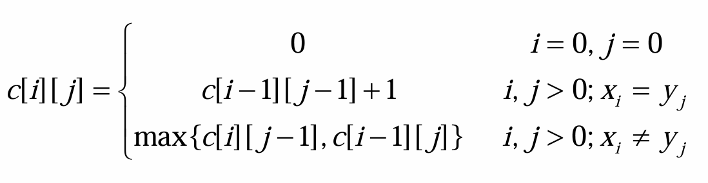{:height 172, :width 633}
		- ```c++
		  void LCSLength(int m, int n, char *x, char *y, int **c, int **b
		  {
		  	int i, j;
		   	for (i = 1; i <= m; i++) c[i][0] = 0;
		   	for (i = 1; i <= n; i++) c[0][i] = 0;
		   	for (i = 1; i <= m; i++)
		        for (j = 1; j <= n; j++) {
		            if (x[i]==y[j]) { 
		                c[i][j]=c[i-1][j-1]+1; 
		                b[i][j]=1;
		                }
		            else if (c[i-1][j]>=c[i][j-1]) {
		                c[i][j]=c[i-1][j]; 
		                b[i][j]=2;
		                }
		            else { 
		                c[i][j]=c[i][j-1]; 
		                b[i][j]=3; 
		                }
		        }
		   }
		   
		  // 构造最长公共子序列
		  void LCS(int i，int j，char *x，int **b)
		   {
		     if (i ==0 || j==0) return;
		     if (b[i][j]== 1){ 
		       LCS(i-1，j-1，x，b); 
		       cout<<x[i]; 
		     }
		     else if (b[i][j]== 2) 
		       LCS(i-1，j，x，b);
		     else 
		       LCS(i，j-1，x，b);
		   }
		  ```
	- 3. 凸多边形最优三角剖分
		- •用多边形顶点的逆时针序列表示凸多边形，即P={v0,v1,…,vn-1}
		  表示具有n条边的凸多边形。
		  •若vi与vj是多边形上不相邻的2个顶点，则线段vivj称为多边形的
		  一条弦。弦将多边形分割成2个多边形{vi,vi+1,…,vj}和{vj,vj+1,…vi}。
		  •多边形的三角剖分是将多边形分割成互不相交的三角形的弦的
		  集合T。
		  •给定凸多边形P，以及定义在由多边形的边和弦组成的三角形
		  上的权函数w。要求确定该凸多边形的三角剖分，使得即该三角
		  剖分中诸三角形上权之和为最小。
		- 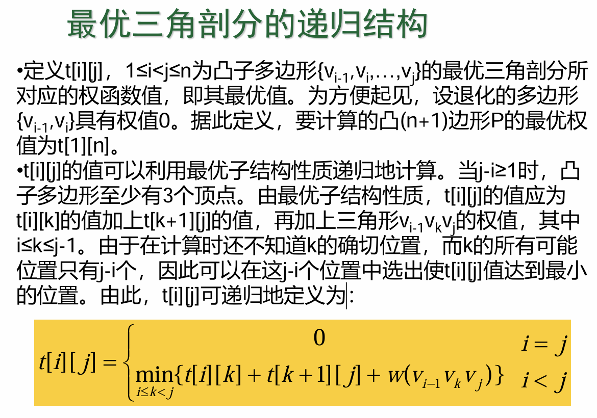
		- ```c++
		  void MinWeightTriangulation(int n，Type **t，int **s)
		   {
		     for (int i = 1; i <= n; i++) t[i][i] = 0;
		     for (int r = 2; r <= n; r++)    /* 多边形节点个数为r+1 */
		         for (int i = 1; i <= n - r+1; i++) {
		           int j=i+r-1;
		           t[i][j] = t[i+1][j]+ w(i-1, i, j);
		           s[i][j] = i;
		           for (int k = i+1; k < i+r-1; k++) {         
		          	/* j= i+r-1 */
		             int u = t[i][k] + t[k+1][j] + w(i-1, k, j);
		             if (u < t[i][j]) { 
		                t[i][j] = u; 
		                s[i][j] = k;   
		             }
		           }	
		         }	
		   }
		  ```
	- 4. 多边形游戏 略
	- 5. 图像压缩
		- 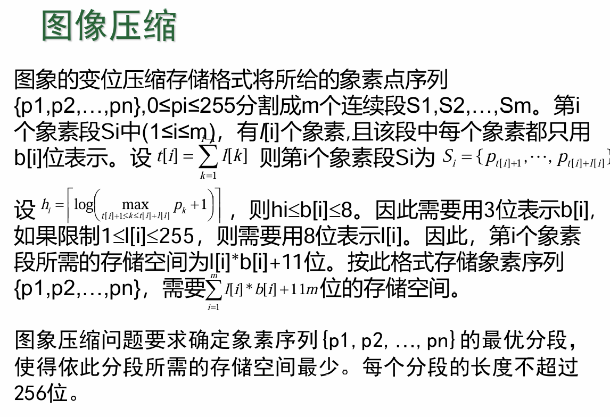
		- 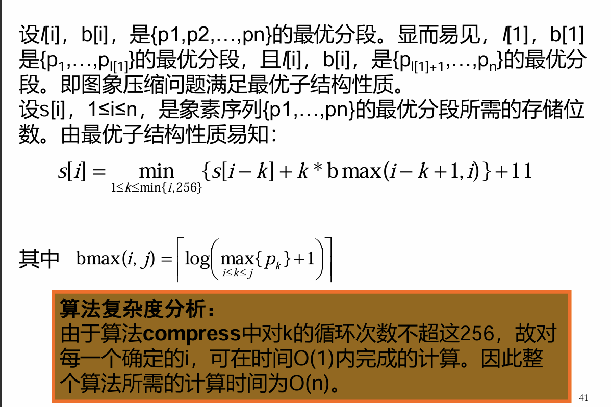{:height 487, :width 719}
		- ```c++
		  void Compress(int n，int p[ ]，int s[ ]，int l[]，int b[ ])  //s[i] 第i个像素段长度
		  {
		  	int Lmax = 256, header =11;
		  	s[0] = 0;
		  	for (int i = 1; i <= n; i++) {    // 遍历像素点
		        b[i]= length(p[i]);             // 像素点所占bit位
		        int bmax = b[i];
		        s[i] = s[i-1] + bmax;
		        l[i] = 1;
		        for (int j = 2; j <= i && j <= Lmax; j++)  {  //像素段长度，i为该段最后一个节点
		          if (bmax <= b[i-j+1]) bmax = b[i-j+1];
		          if( s[i] > s[i-j] + j * bmax ) {
		            s[i] = s[i-j] + j * bmax;
		            l[i] = j;
		          }
		        }
		        s[i] += header;
		      }      
		  }
		  ```
	- 6. 电路布线
		- 其实就是找不相交的最大子集
		- 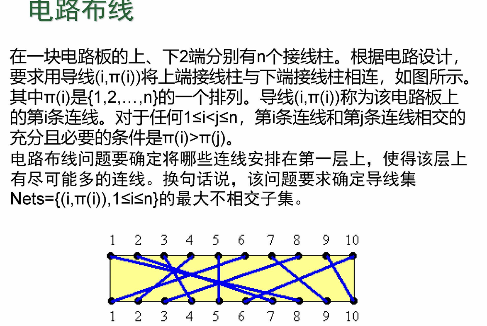{:height 490, :width 719}
		- 总结为：
			- 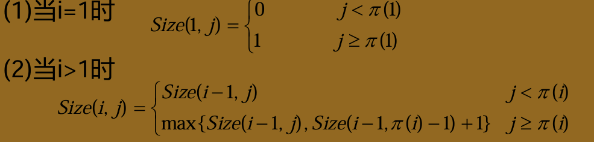
			- 主要是第二个难理解，第一个j<\pi(1)时候直接删掉了，第二种当 j>=\pi(i)时，可以选择或不选择，如果不选的话就是跟第一个一样，如果选的话就是Size(j-1,\pi(i)-1)+1),因为既然选了，那j就不能大于\pi(i)了。
			- ```c++
			  void MNS(int C[], int n, int **size)
			  {
			    for(j = 0; j<C[1];j++)
			      size[1][j] = 0;
			    for(int j = C[1] ; j<n; j++)
			      size[1][j] = 1;
			    for(int i=2; i<n; i++){
			      for(int j=0; j<C[i]; j++)
			        size[i][j] = size[i-1][j];
			      for(int j=C[i]; j<=n; j++)
			        size[i][j] = max(size[i-1][j], size[i-1][C[i]-1]+1);
			    }
			    size[n][n] = max(size([n-1][n], size[n-1][C[n]-1]+1)
			  }
			  ```
	- 7. 流水线调度
	- 8. 0-1背包问题
		- 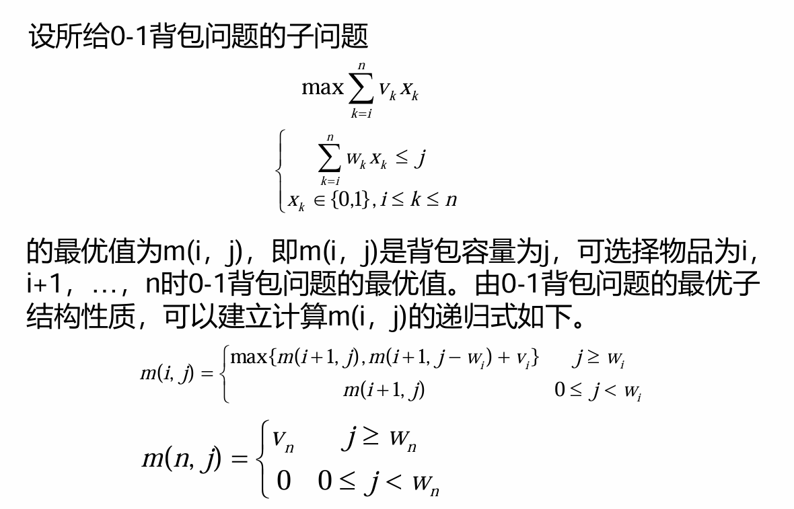
		- ```c++
		  void Knapsack(Type v, int w, int c, int n, Type **m)
		  {
		    int jMax = min(w[n] -1, c);
		    for(int j=0; j<=jMax; j++)
		      m[n][j] = 0;
		    for(int j=w[n]; j<=c; j++)
		      m[n][j] = v[n];
		    for(int i=n-1; i>1; i--){
		      jMax = min(w[i]-1,c);
		    	for(int j=0; j<=jMax; j++)
		        m[i][j] = m[i+1][j];
		      for(int j=w[i]; j<=c; j++)
		        m[i][j] = max(m[i+1][j],m[i+1][j-w[i]]+v[i]);
		     }
		    m[1][c] = m[2][c];
		    if(c>w[1])
		      m[1][c] = max(m[i+1][c],m[2][c-w[1]]+v[1]);
		  }
		  
		  ```
- ## 四 贪心算法 5个案例
- ## 五 回溯法 11个案例
-
-